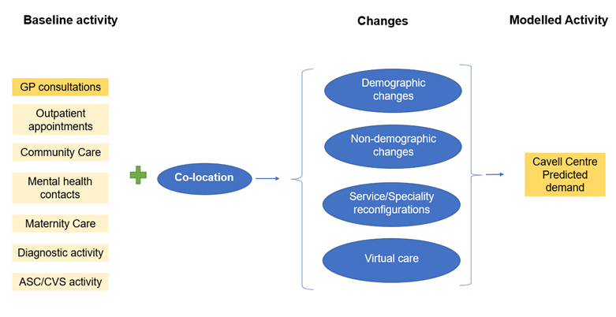

```{r setup, include=FALSE}
knitr::opts_chunk$set(echo = FALSE,
                      warning = FALSE, 
                      message = FALSE,
                      fig.width = 9, 
                      fig.height = 6)

`%!in%` <- Negate(`%in%`)

simpleCap <- function(x) {
  s <- strsplit(x, " ")[[1]]
  paste(toupper(substring(s, 1,1)), substring(s, 2),
        sep="", collapse=" ")
}

library(tidyverse)
library(janitor)
library(knitr)
library(DT)
library(patchwork)
library(sf)
library(ggrepel)
library(networkD3)
library(htmlwidgets)
library(readxl)
library(lubridate)
library(scales)

inline_hook <- function(x) {
 
  if(is.numeric(x)) {
    formatted <- format(x, digits = 2)
    
  } else {
    formatted <- x
  }
  
   paste0("**", formatted, "**")
  
}

knit_hooks$set(inline = inline_hook)

create_dt <- function(x){
  DT::datatable(x,
                extensions = 'Buttons',
                options = list(dom = 'Blfrtip',
                               buttons = c('copy', 'csv', 'excel', 'pdf', 'print'),
                               lengthMenu = list(c(8, 10,50,-1),
                                                 c(8, 10,50,"All"))))
}

## Set SU theme ####
My_rgb2hex <- function(r,g,b) sprintf('#%s',paste(as.hexmode(c(r,g,b)),collapse = ''))

# scale_colour_manual(values = c("#f9bf07", "#686f73", "#5881c1", "#ec6555"))
# scale_colour_manual(values = c("#686f73", "#5881c1", "#ec6555"))

SU_colours <- c (
  `orange` = My_rgb2hex(248,191,7),# "#f9bf07",
  `charcoal` = My_rgb2hex(44,40,37),# "#2c2825",
  `slate` = My_rgb2hex(104,111,115), # "#686f73",
  `blue` = My_rgb2hex(88,29,193), # "#5881c1",
  `red` = My_rgb2hex(236,101,85), # "#ec6555",
  #additional accent colours from word doc template
  `yellow` = My_rgb2hex(252,229,155),
  `grey` = My_rgb2hex(163,168,172),
  `white` = My_rgb2hex(255,255,255),
  #light and dark ends from colour theme in word doc
  `light orange` = My_rgb2hex(253,242,205),
  `dark orange` = My_rgb2hex(124,95,3),
  `light charcoal` = My_rgb2hex(235,233,231),
  `dark charcoal` = 	"#000000",#black
  `light slate` = My_rgb2hex(224,226,227),
  `dark slate` = My_rgb2hex(51,55,57),
  `light blue` = My_rgb2hex(221,229,242),
  `dark blue` = My_rgb2hex(38,61,102),
  `light red` = My_rgb2hex(251,224,220),
  `dark red` = My_rgb2hex(144,29,16),
  `light yellow` = My_rgb2hex(254,249,235),
  `dark yellow` = My_rgb2hex(197,152,5),
  `light grey`=My_rgb2hex(236,237,238),
  `dark grey` = My_rgb2hex(79,84,88),
  `light white`=My_rgb2hex(242,242,242),
  `dark white` =My_rgb2hex(127,127,127),
  `red2` = My_rgb2hex(215,25,28),
  `orange2` = My_rgb2hex(253,174,97),
  `yellow2` = My_rgb2hex(255,255,191),
  `green2` = My_rgb2hex(171,221,164),
  `blue2` = My_rgb2hex(43,131,186)
)


SU_cols <- function(...) {
  cols <- c(...)
  
  if (is.null(cols))
    return (SU_colours)
  
  SU_colours[cols]
}

SU_palettes <- list(
  `main` = SU_cols("orange","charcoal","slate","blue","red"),
  `oranges` = SU_cols("light orange","orange","dark orange"),
  `slates` = SU_cols("light slate","slate","dark slate"),
  `mixed` = SU_cols("dark red","orange","yellow","light blue","slate"),
  `oj_coal` = SU_cols("yellow","orange","red","dark red","dark charcoal"),
  `oj_red` = SU_cols("yellow","orange","red","dark red"),
  `white_oj_coal` = SU_cols("white","yellow","orange","red","dark red","dark charcoal"),#added since shared
  `lyellow_oj_coal` = SU_cols("light yellow","orange","red","dark red","dark charcoal"),#added since shared
  `wy_oj_coal` = SU_cols("white","light yellow","yellow","orange","red","dark red","charcoal","dark charcoal"),
  `red_coal` = SU_cols("red","dark red","charcoal","dark charcoal"),
  `blue_yellow_red` = SU_cols("red2","orange2","yellow2","green2","blue2"),
  `red_yellow_blue` = SU_cols("blue2","green2","yellow2","orange2","red2")
)

SU_pal <- function(palette = "main", reverse = FALSE, ...) {
  pal <- SU_palettes[[palette]]
  
  if (reverse) pal <- rev(pal)
  
  colorRampPalette(pal, ...)
}   

scale_color_SU <- function(palette = "main", discrete = TRUE, reverse = FALSE, ...) {
  pal <- SU_pal(palette = palette, reverse = reverse)
  
  if (discrete) {
    discrete_scale("colour", paste0("SU_", palette), palette = pal, ...)
  } else {
    scale_color_gradientn(colours = pal(256), ...)
  }
}


scale_fill_SU <- function(palette = "main", discrete = TRUE, reverse = FALSE, ...) {
  pal <- SU_pal(palette = palette, reverse = reverse)
  
  if (discrete) {
    discrete_scale("fill", paste0("SU_", palette), palette = pal, ...)
  } else {
    scale_fill_gradientn(colours = pal(256), ...)
  }
}  

##Theme


##set theme settings
theme_SU<-
  function (base_size){
    theme_minimal(
      #base_family = "Segoe UI", 
      base_size=12
    ) %+replace% 
      theme(axis.title = element_text(size=11, face="bold",colour=SU_cols("charcoal")),
            plot.title = element_text(hjust=0,face="bold",size=12,colour=SU_cols("charcoal"),margin=margin(b=4,unit="pt")),
            plot.subtitle = element_text(hjust=0,face="italic",size=10,colour=SU_cols("charcoal"),margin=margin(b=4,unit="pt")),
            plot.caption = element_text(hjust = 0,face="italic",size=10,colour=SU_cols("slate"),margin=margin(b=4,unit="pt")),
            legend.text = element_text(size=10,colour=SU_cols("charcoal")),
            legend.title = element_text(face="bold",size=11,colour=SU_cols("charcoal"),margin=margin(b=4,unit="pt")))
  }


##set theme by 
theme_set(theme_SU())

## Import data ####

# GP codes 
practices <- c('M82048', 'M82047', 'M82040', 'M82018', 'M82034', 'M82002', 'M82016', 'M82060')

# GP patient demographics 
# https://digital.nhs.uk/data-and-information/publications/statistical/patients-registered-at-a-gp-practice/june-2021 

a_practice_list_size <-
  read_csv("Practice_list_demographics/gp-reg-pat-prac-all.csv") %>% 
  clean_names() %>% 
  filter(code %in% practices) 

a_practice_list_size_male_age <-
  read_csv("Practice_list_demographics/gp-reg-pat-prac-sing-age-male.csv") %>% 
  clean_names() %>% 
  filter(org_code %in% practices) %>%
  filter(age != "ALL") %>% 
  mutate(age = as.numeric(age))

a_practice_list_size_female_age <-
  read_csv("Practice_list_demographics/gp-reg-pat-prac-sing-age-female.csv") %>% 
  clean_names() %>% 
  filter(org_code %in% practices) %>%
  filter(age != "ALL") %>% 
  mutate(age = as.numeric(age))

simpleCap <- function(x) {
  s <- strsplit(x, " ")[[1]]
  paste(toupper(substring(s, 1,1)), substring(s, 2),
        sep="", collapse=" ")
}

a_practice_mapping <-
  read_csv("Practice_list_demographics/gp-reg-pat-prac-map.csv") %>% 
  clean_names() %>% 
  filter(practice_code %in% practices) %>% 
  mutate(practice_name = unlist(lapply(practice_name, tolower))) %>%
  mutate(practice_name = unlist(lapply(practice_name, simpleCap)))

# Deprivation by LSOA
a_lsoa_imd_2019 <-
  read_csv("LSOA_IMD_2019.csv") %>% 
  clean_names()

# LSOA distrubution
a_practice_list_size_lsoa <-
  read_csv("Practice_list_demographics/gp-reg-pat-prac-lsoa-all.csv") %>% 
  clean_names() %>% 
  filter(practice_code %in% practices) %>% 
  select(-publication) %>% 
  left_join(a_lsoa_imd_2019, by = c("lsoa_code" = "lsoa11cd"))
  
a_practice_list_size_lsoa_male <-
  read_csv("Practice_list_demographics/gp-reg-pat-prac-lsoa-male.csv") %>% 
  clean_names() %>% 
  filter(practice_code %in% practices) %>% 
  select(-publication) %>% 
  left_join(a_lsoa_imd_2019, by = c("lsoa_code" = "lsoa11cd"))

a_practice_list_size_lsoa_female <-
  read_csv("Practice_list_demographics/gp-reg-pat-prac-lsoa-female.csv") %>% 
  clean_names() %>% 
  filter(practice_code %in% practices) %>% 
  select(-publication) %>% 
  left_join(a_lsoa_imd_2019, by = c("lsoa_code" = "lsoa11cd"))

# Monthly practice list sizes (mass import)
#2018
prac_pop_jan18 <- read_csv("Practice_list_demographics/Practice_population/gp-reg-pat-prac-all-jan-18.csv") %>% 
  clean_names() %>% filter(code %in% practices)
prac_pop_feb18 <- read_csv("Practice_list_demographics/Practice_population/gp-reg-pat-prac-all-feb-18.csv") %>% 
  clean_names() %>% filter(code %in% practices)
prac_pop_mar18 <- read_csv("Practice_list_demographics/Practice_population/gp-reg-pat-prac-all-mar-18.csv") %>% 
  clean_names() %>% filter(code %in% practices)
prac_pop_apr18 <- read_csv("Practice_list_demographics/Practice_population/gp-reg-pat-prac-all-apr-18.csv") %>% 
  clean_names() %>% filter(code %in% practices)
prac_pop_may18 <- read_csv("Practice_list_demographics/Practice_population/gp-reg-pat-prac-all-may-18.csv") %>% 
  clean_names() %>% filter(code %in% practices)
prac_pop_jun18 <- read_csv("Practice_list_demographics/Practice_population/gp-reg-pat-prac-all-jun-18.csv") %>% 
  clean_names() %>% filter(code %in% practices)
prac_pop_jul18 <- read_csv("Practice_list_demographics/Practice_population/gp-reg-pat-prac-all-jul-18.csv") %>% 
  clean_names() %>% filter(code %in% practices)
prac_pop_aug18 <- read_csv("Practice_list_demographics/Practice_population/gp-reg-pat-prac-all-aug-18.csv") %>% 
  clean_names() %>% filter(code %in% practices)
prac_pop_sep18 <- read_csv("Practice_list_demographics/Practice_population/gp-reg-pat-prac-all-sep-18.csv") %>% 
  clean_names() %>% filter(code %in% practices)
prac_pop_oct18 <- read_csv("Practice_list_demographics/Practice_population/gp-reg-pat-prac-all-oct-18.csv") %>% 
  clean_names() %>% filter(code %in% practices)
prac_pop_nov18 <- read_csv("Practice_list_demographics/Practice_population/gp-reg-pat-prac-all-nov-18.csv") %>% 
  clean_names() %>% filter(code %in% practices)
prac_pop_dec18 <- read_csv("Practice_list_demographics/Practice_population/gp-reg-pat-prac-all-dec-18.csv") %>% 
  clean_names() %>% filter(code %in% practices)

#2019
prac_pop_jan19 <- read_csv("Practice_list_demographics/Practice_population/gp-reg-pat-prac-all-jan-19.csv") %>% 
  clean_names() %>% filter(code %in% practices)
prac_pop_feb19 <- read_csv("Practice_list_demographics/Practice_population/gp-reg-pat-prac-all-feb-19.csv") %>% 
  clean_names() %>% filter(code %in% practices)
prac_pop_mar19 <- read_csv("Practice_list_demographics/Practice_population/gp-reg-pat-prac-all-mar-19.csv") %>% 
  clean_names() %>% filter(code %in% practices)
prac_pop_apr19 <- read_csv("Practice_list_demographics/Practice_population/gp-reg-pat-prac-all-apr-19.csv") %>% 
  clean_names() %>% filter(code %in% practices)
prac_pop_may19 <- read_csv("Practice_list_demographics/Practice_population/gp-reg-pat-prac-all-may-19.csv") %>% 
  clean_names() %>% filter(code %in% practices)
prac_pop_jun19 <- read_csv("Practice_list_demographics/Practice_population/gp-reg-pat-prac-all-jun-19.csv") %>% 
  clean_names() %>% filter(code %in% practices)
prac_pop_jul19 <- read_csv("Practice_list_demographics/Practice_population/gp-reg-pat-prac-all-jul-19.csv") %>% 
  clean_names() %>% filter(code %in% practices)
prac_pop_aug19 <- read_csv("Practice_list_demographics/Practice_population/gp-reg-pat-prac-all-aug-19.csv") %>% 
  clean_names() %>% filter(code %in% practices)
prac_pop_sep19 <- read_csv("Practice_list_demographics/Practice_population/gp-reg-pat-prac-all-sep-19.csv") %>% 
  clean_names() %>% filter(code %in% practices)
prac_pop_oct19 <- read_csv("Practice_list_demographics/Practice_population/gp-reg-pat-prac-all-oct-19.csv") %>% 
  clean_names() %>% filter(code %in% practices)
prac_pop_nov19 <- read_csv("Practice_list_demographics/Practice_population/gp-reg-pat-prac-all-nov-19.csv") %>% 
  clean_names() %>% filter(code %in% practices)
prac_pop_dec19 <- read_csv("Practice_list_demographics/Practice_population/gp-reg-pat-prac-all-dec-19.csv") %>% 
  clean_names() %>% filter(code %in% practices)

#2020
prac_pop_jan20 <- read_csv("Practice_list_demographics/Practice_population/gp-reg-pat-prac-all-jan-20.csv") %>% 
  clean_names() %>% filter(code %in% practices)
prac_pop_feb20 <- read_csv("Practice_list_demographics/Practice_population/gp-reg-pat-prac-all-feb-20.csv") %>% 
  clean_names() %>% filter(code %in% practices)
prac_pop_mar20 <- read_csv("Practice_list_demographics/Practice_population/gp-reg-pat-prac-all-mar-20.csv") %>% 
  clean_names() %>% filter(code %in% practices)
prac_pop_apr20 <- read_csv("Practice_list_demographics/Practice_population/gp-reg-pat-prac-all-apr-20.csv") %>% 
  clean_names() %>% filter(code %in% practices)
prac_pop_may20 <- read_csv("Practice_list_demographics/Practice_population/gp-reg-pat-prac-all-may-20.csv") %>% 
  clean_names() %>% filter(code %in% practices)
prac_pop_jun20 <- read_csv("Practice_list_demographics/Practice_population/gp-reg-pat-prac-all-jun-20.csv") %>% 
  clean_names() %>% filter(code %in% practices)
prac_pop_jul20 <- read_csv("Practice_list_demographics/Practice_population/gp-reg-pat-prac-all-jul-20.csv") %>% 
  clean_names() %>% filter(code %in% practices)
prac_pop_aug20 <- read_csv("Practice_list_demographics/Practice_population/gp-reg-pat-prac-all-aug-20.csv") %>% 
  clean_names() %>% filter(code %in% practices)
prac_pop_sep20 <- read_csv("Practice_list_demographics/Practice_population/gp-reg-pat-prac-all-sep-20.csv") %>% 
  clean_names() %>% filter(code %in% practices)
prac_pop_oct20 <- read_csv("Practice_list_demographics/Practice_population/gp-reg-pat-prac-all-oct-20.csv") %>% 
  clean_names() %>% filter(code %in% practices)
prac_pop_nov20 <- read_csv("Practice_list_demographics/Practice_population/gp-reg-pat-prac-all-nov-20.csv") %>% 
  clean_names() %>% filter(code %in% practices)
prac_pop_dec20 <- read_csv("Practice_list_demographics/Practice_population/gp-reg-pat-prac-all-dec-20.csv") %>% 
  clean_names() %>% filter(code %in% practices)

#2021
prac_pop_jan21 <- read_csv("Practice_list_demographics/Practice_population/gp-reg-pat-prac-all-jan-21.csv") %>% 
  clean_names() %>% filter(code %in% practices)
prac_pop_feb21 <- read_csv("Practice_list_demographics/Practice_population/gp-reg-pat-prac-all-feb-21.csv") %>% 
  clean_names() %>% filter(code %in% practices)
prac_pop_mar21 <- read_csv("Practice_list_demographics/Practice_population/gp-reg-pat-prac-all-mar-21.csv") %>% 
  clean_names() %>% filter(code %in% practices)
prac_pop_apr21 <- read_csv("Practice_list_demographics/Practice_population/gp-reg-pat-prac-all-apr-21.csv") %>% 
  clean_names() %>% filter(code %in% practices)
prac_pop_may21 <- read_csv("Practice_list_demographics/Practice_population/gp-reg-pat-prac-all-may-21.csv") %>% 
  clean_names() %>% filter(code %in% practices)

prac_pop_monthly <- 
prac_pop_jan18 %>% 
union(prac_pop_feb18)%>% 
union(prac_pop_mar18)%>% 
union(prac_pop_apr18)%>% 
union(prac_pop_may18)%>% 
union(prac_pop_jun18)%>% 
union(prac_pop_jul18)%>% 
union(prac_pop_aug18)%>% 
union(prac_pop_sep18)%>% 
union(prac_pop_oct18)%>% 
union(prac_pop_nov18)%>% 
union(prac_pop_dec18)%>% 
union(prac_pop_jan19)%>% 
union(prac_pop_feb19)%>% 
union(prac_pop_mar19)%>% 
union(prac_pop_apr19)%>% 
union(prac_pop_may19)%>% 
union(prac_pop_jun19)%>% 
union(prac_pop_jul19)%>% 
union(prac_pop_aug19)%>% 
union(prac_pop_sep19)%>% 
union(prac_pop_oct19)%>% 
union(prac_pop_nov19)%>% 
union(prac_pop_dec19)%>% 
union(prac_pop_jan20)%>% 
union(prac_pop_feb20)%>% 
union(prac_pop_mar20)%>% 
union(prac_pop_apr20)%>% 
union(prac_pop_may20)%>% 
union(prac_pop_jun20)%>% 
union(prac_pop_jul20)%>% 
union(prac_pop_aug20)%>% 
union(prac_pop_sep20)%>% 
union(prac_pop_oct20)%>% 
union(prac_pop_nov20)%>% 
union(prac_pop_dec20)%>% 
union(prac_pop_jan21)%>% 
union(prac_pop_feb21)%>% 
union(prac_pop_mar21)%>% 
union(prac_pop_apr21)%>% 
union(prac_pop_may21) %>% 
  mutate(extract_date = as.Date(extract_date, format = "%d%b%Y"))

rm(
  prac_pop_jan18,
  prac_pop_feb18,
  prac_pop_mar18,
  prac_pop_apr18,
  prac_pop_may18,
  prac_pop_jun18,
  prac_pop_jul18,
  prac_pop_aug18,
  prac_pop_sep18,
  prac_pop_oct18,
  prac_pop_nov18,
  prac_pop_dec18,
  prac_pop_jan19,
  prac_pop_feb19,
  prac_pop_mar19,
  prac_pop_apr19,
  prac_pop_may19,
  prac_pop_jun19,
  prac_pop_jul19,
  prac_pop_aug19,
  prac_pop_sep19,
  prac_pop_oct19,
  prac_pop_nov19,
  prac_pop_dec19,
  prac_pop_jan20,
  prac_pop_feb20,
  prac_pop_mar20,
  prac_pop_apr20,
  prac_pop_may20,
  prac_pop_jun20,
  prac_pop_jul20,
  prac_pop_aug20,
  prac_pop_sep20,
  prac_pop_oct20,
  prac_pop_nov20,
  prac_pop_dec20,
  prac_pop_jan21,
  prac_pop_feb21,
  prac_pop_mar21,
  prac_pop_apr21,
  prac_pop_may21
)

# PHE GP profiles 
# https://fingertips.phe.org.uk/profile/general-practice/data#page/9/gid/3000010/pat/166/par/E38000147/ati/7/are/M82048/iid/219/age/1/sex/4/cid/4/tbm/1

phe_fing_gp_amr              <- read_csv("Practice_list_demographics/Fingertips_GP/GP.data_amr.csv") %>% clean_names()
phe_fing_gp_cancer           <- read_csv("Practice_list_demographics/Fingertips_GP/GP.data_cancer.csv")%>% clean_names()
phe_fing_gp_cancer_referral  <- read_csv("Practice_list_demographics/Fingertips_GP/GP.data_cancer_referrals.csv")%>% clean_names()
phe_fing_gp_cvd_chd          <- read_csv("Practice_list_demographics/Fingertips_GP/GP.data_cvd_chd.csv")%>% clean_names()
phe_fing_gp_cvd_hf_af        <- read_csv("Practice_list_demographics/Fingertips_GP/GP.data_cvd_hf_af.csv")%>% clean_names()
phe_fing_gp_cvd_stroke       <- read_csv("Practice_list_demographics/Fingertips_GP/GP.data_cvd_stroke.csv")%>% clean_names()
phe_fing_gp_diabetes         <- read_csv("Practice_list_demographics/Fingertips_GP/GP.data_diabetes.csv")%>% clean_names()
phe_fing_gp_mh               <- read_csv("Practice_list_demographics/Fingertips_GP/GP.data_mh.csv")%>% clean_names()
phe_fing_gp_msk              <- read_csv("Practice_list_demographics/Fingertips_GP/GP.data_msk.csv")%>% clean_names()
phe_fing_gp_other            <- read_csv("Practice_list_demographics/Fingertips_GP/GP.data_other.csv")%>% clean_names()
phe_fing_gp_practice_summary <- read_csv("Practice_list_demographics/Fingertips_GP/GP.data_practice_summary.csv")%>% clean_names()
phe_fing_gp_resp             <- read_csv("Practice_list_demographics/Fingertips_GP/GP.data_resp.csv")%>% clean_names()
phe_fing_gp_cvd_risk         <- read_csv("Practice_list_demographics/Fingertips_GP/GP.data_cvd_risk.csv")%>% clean_names()

# Reduce PHE GP data
reduce_GP_data <- function(data){
    data %>% 
    select(
      indicator_id, indicator_name, area_code, area_name, sex, age, time_period, 
      count, denominator, value, lower_ci_95_0_limit, upper_ci_95_0_limit
      )
} 

phe_fing_gp_amr %>% 
select(
  indicator_id, indicator_name, area_code, area_name, sex, age, time_period, 
  count, denominator, value, lower_ci_95_0_limit, upper_ci_95_0_limit
)

phe_fing_gp_amr              <- reduce_GP_data(phe_fing_gp_amr)
phe_fing_gp_cancer           <- reduce_GP_data(phe_fing_gp_cancer)
phe_fing_gp_cancer_referral  <- reduce_GP_data(phe_fing_gp_cancer_referral)
phe_fing_gp_cvd_chd          <- reduce_GP_data(phe_fing_gp_cvd_chd)
phe_fing_gp_cvd_hf_af        <- reduce_GP_data(phe_fing_gp_cvd_hf_af)
phe_fing_gp_cvd_risk         <- reduce_GP_data(phe_fing_gp_cvd_risk)
phe_fing_gp_cvd_stroke       <- reduce_GP_data(phe_fing_gp_cvd_stroke)
phe_fing_gp_diabetes         <- reduce_GP_data(phe_fing_gp_diabetes)
phe_fing_gp_mh               <- reduce_GP_data(phe_fing_gp_mh)
phe_fing_gp_msk              <- reduce_GP_data(phe_fing_gp_msk)
phe_fing_gp_other            <- reduce_GP_data(phe_fing_gp_other)
phe_fing_gp_practice_summary <- reduce_GP_data(phe_fing_gp_practice_summary)
phe_fing_gp_resp             <- reduce_GP_data(phe_fing_gp_resp)

phe_clinical_indicators <-
  phe_fing_gp_amr  %>%
  union(phe_fing_gp_cancer) %>%          
  union(phe_fing_gp_cancer_referral ) %>%
  union(phe_fing_gp_cvd_chd         ) %>%
  union(phe_fing_gp_cvd_hf_af       ) %>%
  union(phe_fing_gp_cvd_risk        ) %>%
  union(phe_fing_gp_cvd_stroke      ) %>%
  union(phe_fing_gp_diabetes        ) %>%
  union(phe_fing_gp_mh              ) %>%
  union(phe_fing_gp_msk             ) %>%
  union(phe_fing_gp_other           ) %>%
  union(phe_fing_gp_resp            ) %>% 
  filter(area_code %in% practices)

## Describe populatiom demographics ####
# Patient population pyramids
# Count
b_practice_pop_pyramid <-
a_practice_list_size_male_age %>% 
  left_join(a_practice_mapping %>% 
              select(practice_code, practice_name), by = c("org_code" = "practice_code")) %>% 
  select(org_code, practice_name, age, number_of_patients) %>% 
  rename(male_patient_count = number_of_patients) %>% 
  left_join(
    a_practice_list_size_female_age %>% 
      select(org_code, age, number_of_patients) %>% 
      rename(female_patient_count = number_of_patients),
    by = c("org_code", "age")
  ) %>% 
  mutate(male_patient_count_neg = -male_patient_count) 


## Deprivation ####
practice_pop_imd_decile <- 
a_practice_list_size_lsoa %>% 
  select(lsoa_code, practice_code, number_of_patients, imd_decil) %>% 
  left_join(a_practice_mapping %>% 
              select(practice_code, practice_name), by = c("practice_code")) %>% 
  group_by(practice_name, imd_decil) %>% 
  summarise(count = sum(number_of_patients)) %>% 
  mutate(prop = count/sum(count)*100) 
## Clinical profile ####
phe_clinical_indicators_qof_comb <-
phe_clinical_indicators %>% 
  filter(str_detect(indicator_name, "QOF")) %>% 
  group_by(indicator_id, indicator_name, time_period) %>% 
  summarise(comb_count = sum(count),
            comb_denom = sum(denominator)) %>% 
  mutate(comb_value = comb_count/comb_denom*100) %>% 
  ungroup()

qof_indicator_desc <-
tribble(
  ~indicator_id, ~desc, ~group,
  212,  "Stroke", "CVD",
  219,  "Hypertension", "CVD",
  241,  "Diabetes", "General",
  247,  "Dementia", "General",
  253,  "COPD", "Resp", 
  258,  "CKD", "General",
  262,  "HF", "CVD",
  273,  "CHD", "CVD",
  276,  "Cancer", "General",
  280,  "AF", "CVD",
  285,  "Athsma", "Resp",
  90581, "Mental Health", "MH",
  90646, "Depression", "MH",
  91269, "RA", "General",
  91280, "Smoking", "Resp",
  92588, "Obesity", "General",)

## Consultation data ####

cons_jan19 <- read_csv("Consultation_data/CCG_CSV_Jan_19.csv") %>% filter(STP_ONS_CODE == "E54000011")
cons_feb19 <- read_csv("Consultation_data/CCG_CSV_Feb_19.csv") %>% filter(STP_ONS_CODE == "E54000011")
cons_mar19 <- read_csv("Consultation_data/CCG_CSV_Mar_19.csv") %>% filter(STP_ONS_CODE == "E54000011")
cons_apr19 <- read_csv("Consultation_data/CCG_CSV_Apr_19.csv") %>% filter(STP_ONS_CODE == "E54000011")
cons_may19 <- read_csv("Consultation_data/CCG_CSV_May_19.csv") %>% filter(STP_ONS_CODE == "E54000011")
cons_jun19 <- read_csv("Consultation_data/CCG_CSV_Jun_19.csv") %>% filter(STP_ONS_CODE == "E54000011")
cons_jul19 <- read_csv("Consultation_data/CCG_CSV_Jul_19.csv") %>% filter(STP_ONS_CODE == "E54000011")
cons_aug19 <- read_csv("Consultation_data/CCG_CSV_Aug_19.csv") %>% filter(STP_ONS_CODE == "E54000011")
cons_sep19 <- read_csv("Consultation_data/CCG_CSV_Sep_19.csv") %>% filter(STP_ONS_CODE == "E54000011")
cons_oct19 <- read_csv("Consultation_data/CCG_CSV_Oct_19.csv") %>% filter(STP_ONS_CODE == "E54000011")
cons_nov19 <- read_csv("Consultation_data/CCG_CSV_Nov_19.csv") %>% filter(STP_ONS_CODE == "E54000011")
cons_dec19 <- read_csv("Consultation_data/CCG_CSV_Dec_19.csv") %>% filter(STP_ONS_CODE == "E54000011")

cons_jan20 <- read_csv("Consultation_data/CCG_CSV_Jan_20.csv") %>% filter(STP_ONS_CODE == "E54000011")
cons_feb20 <- read_csv("Consultation_data/CCG_CSV_Feb_20.csv") %>% filter(STP_ONS_CODE == "E54000011")
cons_mar20 <- read_csv("Consultation_data/CCG_CSV_Mar_20.csv") %>% filter(STP_ONS_CODE == "E54000011")
cons_apr20 <- read_csv("Consultation_data/CCG_CSV_Apr_20.csv") %>% filter(STP_ONS_CODE == "E54000011")
cons_may20 <- read_csv("Consultation_data/CCG_CSV_May_20.csv") %>% filter(STP_ONS_CODE == "E54000011")
cons_jun20 <- read_csv("Consultation_data/CCG_CSV_Jun_20.csv") %>% filter(STP_ONS_CODE == "E54000011")
cons_jul20 <- read_csv("Consultation_data/CCG_CSV_Jul_20.csv") %>% filter(STP_ONS_CODE == "E54000011")
cons_aug20 <- read_csv("Consultation_data/CCG_CSV_Aug_20.csv") %>% filter(STP_ONS_CODE == "E54000011")
cons_sep20 <- read_csv("Consultation_data/CCG_CSV_Sep_20.csv") %>% filter(STP_ONS_CODE == "E54000011")
cons_oct20 <- read_csv("Consultation_data/CCG_CSV_Oct_20.csv") %>% filter(STP_ONS_CODE == "E54000011")
cons_nov20 <- read_csv("Consultation_data/CCG_CSV_Nov_20.csv") %>% filter(STP_ONS_CODE == "E54000011")
cons_dec20 <- read_csv("Consultation_data/CCG_CSV_Dec_20.csv") %>% filter(STP_ONS_CODE == "E54000011")

cons_jan21 <- read_csv("Consultation_data/CCG_CSV_Jan_21.csv") %>% filter(STP_ONS_CODE == "E54000011")
cons_feb21 <- read_csv("Consultation_data/CCG_CSV_Feb_21.csv") %>% filter(STP_ONS_CODE == "E54000011")
cons_mar21 <- read_csv("Consultation_data/CCG_CSV_Mar_21.csv") %>% filter(STP_ONS_CODE == "E54000011")
cons_apr21 <- read_csv("Consultation_data/CCG_CSV_Apr_21.csv") %>% filter(STP_ONS_CODE == "E54000011")
cons_may21 <- read_csv("Consultation_data/CCG_CSV_May_21.csv") %>% filter(STP_ONS_CODE == "E54000011")
#cons_jun21 <- read_csv("Consultation_data/CCG_CSV_Jun_21.csv") %>% filter(STP_ONS_CODE == "E54000011")
#cons_jul21 <- read_csv("Consultation_data/CCG_CSV_Jul_21.csv") %>% filter(STP_ONS_CODE == "E54000011")
#cons_aug21 <- read_csv("Consultation_data/CCG_CSV_Aug_21.csv") %>% filter(STP_ONS_CODE == "E54000011")
#cons_sep21 <- read_csv("Consultation_data/CCG_CSV_Sep_21.csv") %>% filter(STP_ONS_CODE == "E54000011")
#cons_oct21 <- read_csv("Consultation_data/CCG_CSV_Oct_21.csv") %>% filter(STP_ONS_CODE == "E54000011")
#cons_nov21 <- read_csv("Consultation_data/CCG_CSV_Nov_21.csv") %>% filter(STP_ONS_CODE == "E54000011")
#cons_dec21 <- read_csv("Consultation_data/CCG_CSV_Dec_21.csv") %>% filter(STP_ONS_CODE == "E54000011")

consultations <-
  cons_jan19 %>% 
  union(cons_feb19) %>% 
  union(cons_mar19) %>%
  union(cons_apr19) %>%
  union(cons_may19) %>%
  union(cons_jun19) %>%
  union(cons_jul19) %>%
  union(cons_aug19) %>%
  union(cons_sep19) %>%
  union(cons_oct19) %>%
  union(cons_nov19) %>%
  union(cons_dec19) %>%
  union(cons_jan20) %>%
  union(cons_feb20) %>%
  union(cons_mar20) %>%
  union(cons_apr20) %>%
  union(cons_may20) %>%
  union(cons_jun20) %>%
  union(cons_jul20) %>%
  union(cons_aug20) %>%
  union(cons_sep20) %>%
  union(cons_oct20) %>%
  union(cons_nov20) %>%
  union(cons_dec20) %>%
  union(cons_jan21) %>%
  union(cons_feb21) %>%
  union(cons_mar21) %>%
  union(cons_apr21) %>%
  union(cons_may21) %>% 
  clean_names() 

rm(
  cons_jan19,
  cons_feb19,
  cons_mar19,
  cons_apr19,
  cons_may19,
  cons_jun19,
  cons_jul19,
  cons_aug19,
  cons_sep19,
  cons_oct19,
  cons_nov19,
  cons_dec19,
  cons_jan20,
  cons_feb20,
  cons_mar20,
  cons_apr20,
  cons_may20,
  cons_jun20,
  cons_jul20,
  cons_aug20,
  cons_sep20,
  cons_oct20,
  cons_nov20,
  cons_dec20,
  cons_jan21,
  cons_feb21,
  cons_mar21,
  cons_apr21,
  cons_may21
  ) 

# Compare age/sex profile of 8x practices to other practices in CCG
# ons_ccg_code == E38000257 

STW_practices <-
  read_csv("Practice_list_demographics/gp-reg-pat-prac-sing-age-male.csv") %>% 
  clean_names() %>% 
  filter(ons_ccg_code == "E38000257") %>% 
  select(org_code) %>% 
  distinct() # 8x practices out of 52 total

STW_practices_external_flag <-
STW_practices %>% 
  mutate(external = case_when(org_code %in% practices ~ "internal", 
                              TRUE ~ "external")) %>% 
  inner_join(read_csv("Practice_list_demographics/gp-reg-pat-prac-sing-age-male.csv") %>% 
               clean_names() %>% 
               select(org_code, sex, age, number_of_patients),
             by = c("org_code")
             ) %>%
  left_join(read_csv("Practice_list_demographics/gp-reg-pat-prac-sing-age-female.csv") %>% 
               clean_names() %>% 
               select(org_code, sex, age, number_of_patients),
             by = c("org_code", "age")
  ) %>% 
  rename(male_count = number_of_patients.x,
         female_count = number_of_patients.y) %>% 
  select(-sex.x, -sex.y) %>%
  mutate(age = as.numeric(age)) 

# Check shape of Age/Gender distribution of Cavel centres against other CCG patients
STW_practices_external_flag_long <-
STW_practices_external_flag %>%
  group_by(external, age) %>% 
  summarise(male_sum = sum(male_count),
            female_sum = sum(female_count)) %>% 
  mutate(male_prop = male_sum/sum(male_sum)*100,
         female_prop = female_sum/sum(female_sum) *100) %>%
  mutate(male_prop_neg = -male_prop) %>% 
  select(external, age, female_prop, male_prop_neg) %>% 
  pivot_longer(cols = c(-external, -age)) %>% 
  mutate(name = case_when(name == "female_prop" ~ "Female",
                          name == "male_prop_neg" ~ "Male")) %>% 
  mutate(external = case_when(external == "external" ~ "Other Practices in CCG",
                              external == "internal" ~ "8x Cavell Practices")) 

consultations_cavell <-
consultations %>% 
  select(ccg_ons_code, appointment_date, appt_status, 
         hcp_type, appt_mode, time_between_book_and_appt, 
         count_of_appointments) %>% 
  mutate(appointment_date = as.Date(appointment_date, format = "%d%b%Y")) %>% 
  mutate(cavell_appts = count_of_appointments*0.128)


## OPA care ####
opa_by_speciality <- 
  read_csv("Activity_data_raw/OPA_by_Speciality_19_20.csv") %>% 
  clean_names() %>% 
  rename(practice_name = x2)

opa_colated <- 
  read_csv("Activity_data_raw/OPA_colocated_1620.csv") %>% 
  clean_names() %>% 
  mutate(appointment_date = as.Date(appointment_date, "%d/%m/%Y"))

opa_colated_19 <-
  opa_colated %>% 
  filter(substr(appointment_date,1,4) == "2019")

## Community care - ShropCom ####

# ShropCom referrals 
ShropCom_refs_1819 <- read_csv("Activity_data_raw/ShropCom_refs_1819.csv")

names(ShropCom_refs_1819) <- 
  c('RECORDNUMBER',
    'PatientID',
    'GENDERCODE', 
    'ETHNICCATEGORY',
    'PROVIDERCODE',
    'PROVIDERORGCODE',
    'CCGOFRESIDENCE',
    'LSOA2011',
    'AGEATREPORTINGPERIODSTART_DER',
    'REFERRALREQRECDATE',
    'SOURCEOFREFERRALFORCOMMUNITY',
    'REFERRINGORGCODE',
    'PRIMARYREASONFORREFERRAL',
    'PRACTICECODE',
    'CCGOFGPPRACTICE',
    'ReasonForReferralToCommunityCareID',
    'ReasonForReferralToCommunityCareCode',
    'ReasonForReferralToCommunityCareDescription',
    'ReasonForReferralToCommunityCareDescriptionShort',
    'ReasonForReferralToCommunityCareIsLatest',
    'ReasonForReferralToCommunityCareAuditKeyID')

# Source of referral look up
com_ref_souce_desc_lookup <-
  tribble(
    ~code, ~ref_souce_desc,
    01,	"General Medical Practitioner Practice",
    02,	"Self referral",
    03,	"Carer/Relative",
    04,	"Employer",
    05,	"Emergency Care Department",
    06,	"Acute Hospital Inpatient/Outpatient Department",
    07,	"Community Health Service",
    08,	"Dental Practice",
    09,	"National Screening Programme",
    10,	"Educational Establishment",
    11,	"Local Authority Social Services",
    12,	"Hospice",
    13,	"Care Home",
    14,	"Police",
    15,	"Courts",
    16,	"Probation Service",
    17,	"Prison Health Service",
    18,	"Asylum Service",
    19,	"Telephone or Electronic Access Service",
    20,	"Voluntary Sector",
    21,	"Independent Sector",
    22,	"Ambulance Service",
    23,	"Mental Health Service",
    )

ShropCom_refs_1819 <-
  ShropCom_refs_1819 %>% 
  clean_names() %>% 
  mutate(child_adult = case_when(
    ageatreportingperiodstart_der <= 18 ~ "Child",
    TRUE ~ "Adult")) %>% 
  left_join(com_ref_souce_desc_lookup, by = c("sourceofreferralforcommunity" = "code")) %>% 
  mutate(source_ref_type = case_when(
    sourceofreferralforcommunity %in% c(01) ~ "GP",
    sourceofreferralforcommunity %in% c(05, 06, 22) ~ "Acute",
    TRUE ~ "Other")) %>% 
  mutate(high_volume_reason = 
           case_when(
             reason_for_referral_to_community_care_description_short %in% c(
               "Foot care/problems", 
               "Healthy child pathway",
               "Musculoskeletal problems",
               "Haematology/phlebotomy",
               "Diabetes") ~ "High-volume reason",
             TRUE ~ "Low-volume reason"))


# ShropCom care contacts
ShropCom_contacts_1620 <- read_csv("Activity_data_raw/ShropCom_contacts_1620.csv")

names(ShropCom_contacts_1620) <- 
    c(
      'RECORDNUMBER',
      'PatientID',
      'GENDERCODE',
      'ETHNICCATEGORY',
      'PROVIDERCODE',
      'PROVIDERORGCODE',
      'CCGOFRESIDENCE',
      'LSOA2011',
      'AGEATREPORTINGPERIODSTART_DER',
      'CARECONTACTID',
      'CARECONTACTDATE',
      'ADMINCATCODE',
      'CONSULTATIONTYPE',
      'CARECONTACTSUBJECT',
      'CONMEDIUMUSED',
      'SITECODE',
      'PRACTICECODE',
      'CCGOFGPPRACTICE',
      'CSURowNumber',
      'CAREACTIVITYID',
      'CARECONTACTID',
      'ACTIVITYTYPECODE',
      'CAREPROFLOCALID',
      'CONTACTDURATION',
      'PROCSCHEME',
      'PROCEDURECODE',
      'SCHEMEINUSE',
      'FINDINGCODE',
      'OBSSCHEMEINUSE',
      'OBSCODE',
      'OBSVALUE',
      'UCUMUNIT',
      'RECORDNUMBER',
      'CYP202UNIQUEID',
      'PROVIDERORGCODE',
      'UNIQUECSDSID',
      'BSPUNIQUEID',
      'UNIQUEARECONTACTID',
      'UNIQUECAREACTID',
      'DatasetId',
      'FileId',
      'TransactionId',
      'SubmittedZipFile',
      'SubmittedFile',
      'ProviderCodeUserEmail',
      'ReceivedDate',
      'LoadDate',
      'REPORTINGPERIODSTARTDATE',
      'REPORTINGPERIODENDDATE',
      'FILETYPE',
      'CurrentRecord',
      'FileName',
      'EFFECTIVE_FROM',
      'DatSetVer',
      'Unique_MonthID'
      )

ShropCom_contacts_1620 <-
  ShropCom_contacts_1620 %>% 
  clean_names() %>% 
  mutate(carecontactdate = as.Date(carecontactdate))

# Consultation medium 
# https://www.datadictionary.nhs.uk/archive/DD%20Release%20December%202019/data_dictionary/attributes/c/cons/consultation_medium_used_de.asp?shownav=1
consultation_medium_type <-
  tribble(
    ~code, ~cons_medium_desc,
    "01",	"Face to face communication",
    "02",	"Telephone",
    "03",	"Telemedicine",
    "04",	"Talk type for a PERSON unable to speak",
    "05",	"Email",
    "06",	"Short Message Service (SMS) - Text Messaging",
    "07",	"On-line Triage",
    "98",	"Other (not listed)")

# Community care activity
# https://datadictionary.nhs.uk/data_elements/community_care_activity_type.html 
care_activity_type <-
  tribble(
    ~code, ~activity_type_desc,
    "01", "Administering Tests",
    "02", "Assessment",
    "03", "CLINICAL INTERVENTION", 
    "04", "Counselling, Advice, Support",
    "05", "PATIENT  Specific Health Promotion",
    "06", "Multidisciplinary Team Review",
    "07", "Supporting Another Clinician",
    "08", "Health Visitor  New Birth Visit",
    "09", "Health Visitor  Health Review (6-8 weeks)",
    "10", "Health Visitor Health Review (1 year)",
    "11", "Health Visitor  Health Review (2-2.5 years)",
    "12", "Health Visitor Formal handover to School Nursing Service (4-5 years)",
    "97", "Other (not listed)",
    "98", "Other (Retired 01 September 2015)"
    )

ShropCom_contacts_1620 %>% 
  group_by(substr(carecontactdate,1,4)) %>% 
  summarise(n = n())

ShropCom_contacts <-
  ShropCom_contacts_1620 %>%
  filter(substr(carecontactdate,1,4) == "2019") %>% # Adjust year filter as necessary 
  select(recordnumber, 
         ageatreportingperiodstart_der, 
         carecontactid, 
         carecontactdate,
         consultationtype, 
         conmediumused, 
         careactivityid, 
         activitytypecode) %>% 
  # Age
  mutate(child_adult = case_when(ageatreportingperiodstart_der <= 18 ~ "Child",
                                 TRUE ~ "Adult")) %>% 
  # Consultation medium 
  left_join(consultation_medium_type, by = c("conmediumused" = "code")) %>% 
  mutate(consult_type_group = case_when(conmediumused == "01" ~ "Face-to-face",
                                        TRUE ~ "Other")) %>% 
  # Activity type
  left_join(care_activity_type, by = c("activitytypecode" = "code")) %>% 
  mutate(contact_activity_group = case_when(
    activity_type_desc %in% c("Administering Tests", "Assessment") ~ "Assessment/Tests",
    activity_type_desc %in% c("CLINICAL INTERVENTION") ~ "Clinical Intervention",
    str_detect(activity_type_desc, "Health Visitor") ~ "Health visitor",
    is.na(activity_type_desc) ~ "Unknown", 
    TRUE ~ "Other"))  
  

ShropCom_contacts %>% 
  summarise(
    row_count = n(),
    record_count = n_distinct(recordnumber),
    care_contact_count = n_distinct(carecontactid)
    )

ShropCom_contacts_1819_grouped <-    
  ShropCom_contacts %>%
  group_by(child_adult,
           consult_type_group,
           contact_activity_group
           ) %>% 
  summarise(care_contacts = n_distinct(carecontactid))

# Flow/sankey data
ShropCom_contacts_flow <-
  # Age
  ShropCom_contacts %>% 
  mutate(from = "A) All care contacts") %>% 
  group_by(from, child_adult) %>% 
  summarise(care_contacts = n_distinct(carecontactid)) %>% 
  mutate(child_adult = paste("B)", child_adult)) %>% 
  rename(to = child_adult) %>% 
  # Contact medium
  union(
    ShropCom_contacts %>% 
      filter(child_adult == "Adult") %>% 
      mutate(from = "B) Adult") %>% 
      group_by(from, consult_type_group) %>% 
      summarise(care_contacts = n_distinct(carecontactid)) %>% 
      mutate(consult_type_group = paste("C)", consult_type_group)) %>% 
      rename(to = consult_type_group)) %>% 
  union(
    ShropCom_contacts %>% 
      filter(child_adult == "Child") %>% 
      mutate(from = "B) Child") %>% 
      group_by(from, consult_type_group) %>% 
      summarise(care_contacts = n_distinct(carecontactid)) %>% 
      mutate(consult_type_group = paste("D)", consult_type_group)) %>% 
      rename(to = consult_type_group)) %>% 
  # Contact activity type
  union(
    ShropCom_contacts %>% 
      filter(child_adult == "Adult",
             consult_type_group == "Face-to-face") %>% 
      mutate(from = "C) Face-to-face") %>% 
      group_by(from, contact_activity_group) %>% 
      summarise(care_contacts = n_distinct(carecontactid)) %>% 
      mutate(contact_activity_group = paste("E)", contact_activity_group)) %>% 
      rename(to = contact_activity_group)) %>% 
  union(
    ShropCom_contacts %>% 
      filter(child_adult == "Adult",
             consult_type_group == "Other") %>% 
      mutate(from = "C) Other") %>% 
      group_by(from, contact_activity_group) %>% 
      summarise(care_contacts = n_distinct(carecontactid)) %>% 
      mutate(contact_activity_group = paste("F)", contact_activity_group)) %>% 
      rename(to = contact_activity_group)) %>% 
  union(
    ShropCom_contacts %>% 
      filter(child_adult == "Child",
             consult_type_group == "Face-to-face") %>% 
      mutate(from = "D) Face-to-face") %>% 
      group_by(from, contact_activity_group) %>% 
      summarise(care_contacts = n_distinct(carecontactid)) %>% 
      mutate(contact_activity_group = paste("G)", contact_activity_group)) %>% 
      rename(to = contact_activity_group)) %>% 
  union(
    ShropCom_contacts %>% 
      filter(child_adult == "Child",
             consult_type_group == "Other") %>% 
      mutate(from = "D) Other") %>% 
      group_by(from, contact_activity_group) %>% 
      summarise(care_contacts = n_distinct(carecontactid)) %>% 
      mutate(contact_activity_group = paste("H)", contact_activity_group)) %>% 
      rename(to = contact_activity_group)) %>% 
  ungroup()

# Nodes
ShropCom_contacts_nodes <-
  data.frame(
    ShropCom_contacts_flow %>% 
      select(from) %>% 
      rename(nodes = from) %>%
      union(
        ShropCom_contacts_flow %>% 
          select(to) %>% 
          rename(nodes = to)
      ) %>% 
      distinct() %>% 
      rowid_to_column() %>% 
      mutate(rowid = as.numeric(rowid-1)) %>% 
      left_join(ShropCom_contacts_flow %>% 
                  mutate(to_value = paste0(to, ": ", care_contacts)) %>% 
                  select(to, to_value),
                by = c("nodes" = "to")) %>% #Bring in merged node names (name + value) from 'to' column
      mutate(to_value = case_when(is.na(to_value)~ paste0(nodes, ": 82496"),   ## Remember to manually add in the overall total (fudge!)
                                  TRUE ~ to_value))  
    )

# Links/edges
ShropCom_contact_links <-
  data.frame(
    ShropCom_contacts_flow %>% 
      left_join(ShropCom_contacts_nodes, by = c("from" = "nodes")) %>% 
      rename(source = rowid) %>% 
      mutate(source = as.numeric(source)) %>% 
      left_join(ShropCom_contacts_nodes, by = c("to" = "nodes")) %>% 
      rename(target = rowid) %>% 
      mutate(target = as.numeric(target)) %>% 
      select(source, target, care_contacts)
  )

ShropCom_contact_vis <-
sankeyNetwork(Links = ShropCom_contact_links, 
              Nodes = ShropCom_contacts_nodes,
              Source = "source",
              Target = "target",
              Value = "care_contacts",
              NodeID = "to_value", #Merged field with node name and contact count
              nodeWidth = 15,
              unit = "care contacts", 
              fontSize = 12,
              fontFamily = "sans-serif"
              )
## Mental health ####

# MHSDS data - contact activity   

# MHSDS - Activity Location Type Code
# https://datadictionary.nhs.uk/attributes/activity_location_type_code.html
mhsds_activity_location_type_code_lookup <-
  tribble(
  ~code,	~description,
  "A01",	"Patients Home",
  "A02",	"Carer's Home",
  "A03",	"Patient's Workplace",
  "A04",  "Other Patient Related Location",
  "B01",	"Primary Care Health Centre",
  "B02",	"Polyclinic",
  "C01",	"General Medical Practitioner Practice",
  "C02",	"Dental Practice",
  "C03",	"Ophthalmic Medical Practitioner Premises",
  "D01",	"Walk In Centre",
  "D02",	"Out of Hours Centre",
  "D03",	"Emergency Community Dental Service",
  "E01",	"Out-Patient Clinic",
  "E02",	"Ward",
  "E03",	"Day Hospital",
  "E04",	"Emergency Care Department or Minor Injuries Department",
  "E99",	"Other Departments",
  "F01",	"Hospice",
  "G01",	"Care Home Without Nursing",
  "G02",	"Care Home With Nursing",
  "G03",	"Children's Home",
  "G04",  "Integrated Care Home Without Nursing  and Care Home With Nursing",
  "H01",	"Day Centre",
  "J01",	"Resource Centre",
  "K01",	"Sure Start Children’s Centre",
  "K02",	"Child Development Centre",
  "L01",	"School",
  "L02",	"Further Education College",
  "L03",	"University",
  "L04",	"Nursery Premises",
  "L05",	"Other Childcare Premises",
  "L06",	"Training Establishments",
  "L99",	"Other Educational Premises",
  "M01",	"Prison",
  "M02",	"Probation Service Premises",
  "M03",	"Police Station / Police Custody Suite",
  "M04",	"Young Offender Institution",
  "M05",	"Immigration Removal Centre",
  "M06",	"Young Offender Institution (15-17)",
  "M07",	"Young Offender Institution (18-21)",
  "N01",	"Street or other public open space",
  "N02",	"Other publicly accessible area or building",
  "N03",	"Voluntary or charitable agency premises",
  "N04",	"Dispensing Optician Premises",
  "N05",	"Dispensing Pharmacy Premises",
  "X01",	"Other locations not elsewhere classified"
  )

mhsds_contacts_1620 <- 
  read_csv("Activity_data_raw/MHSDS_contacts_1620.csv") %>% 
  clean_names() %>% 
  left_join(mhsds_activity_location_type_code_lookup, by = c("act_loc_type_code" = "code")) %>% 
  #select(act_loc_type_code, description) %>% 
  drop_na(description) %>% 
  mutate(location_type_group = 
           case_when(
             act_loc_type_code %in% c("B01", "B02", "C01") ~ "Primary Care",
             act_loc_type_code %in% c("E02", "E03", "E04", "E99", "F01") ~ "Inpatient",
             act_loc_type_code %in% c("D01", "D02", "E01") ~ "Outpatient",
             TRUE ~ "Community")) %>% 
  mutate(child_adult = 
           case_when(
             age_rep_period_start < 18 ~ "Child",
             TRUE ~ "Adult"
           )) %>% 
  mutate(cons_medium_used = as.numeric(cons_medium_used)) %>% 
  left_join(consultation_medium_type %>% 
              mutate(code = as.numeric(code)),
            by = c("cons_medium_used" = "code")) %>% 
  mutate(cons_medium = 
           case_when(
             cons_medium_used == 01 ~ "Face-to-face",
             TRUE ~ "Other"
           )) %>% 
  mutate(care_cont_date = as.Date(care_cont_date, "%d/%m/%Y"))
 
mhsds_contacts_19 <-
mhsds_contacts_1620  %>% 
  filter(substr(care_cont_date, 1,4) == "2019")

mhsds_contacts_20_grouped <-
  mhsds_contacts_19 %>% 
  group_by(child_adult, cons_medium, location_type_group) %>% 
  summarise(contact_count = n_distinct(care_contact_id))

# Reorganised
# Flow/sankey data
mhsds__contacts_flow <-
  # Age
  mhsds_contacts_19 %>% 
  mutate(from = "A) All care contacts") %>% 
  group_by(from, child_adult) %>% 
  summarise(care_contacts = n_distinct(care_contact_id)) %>% 
  mutate(child_adult = paste("B)", child_adult)) %>% 
  rename(to = child_adult) %>% 
  # Contact medium
  union(
    mhsds_contacts_19 %>% 
      filter(child_adult == "Adult") %>% 
      mutate(from = "B) Adult") %>% 
      group_by(from, cons_medium) %>% 
      summarise(care_contacts = n_distinct(care_contact_id)) %>% 
      mutate(cons_medium = paste("C)", cons_medium)) %>% 
      rename(to = cons_medium)) %>% 
  union(
    mhsds_contacts_19 %>% 
      filter(child_adult == "Child") %>% 
      mutate(from = "B) Child") %>% 
      group_by(from, cons_medium) %>% 
      summarise(care_contacts = n_distinct(care_contact_id)) %>% 
      mutate(cons_medium = paste("D)", cons_medium)) %>% 
      rename(to = cons_medium)) %>% 
  # Contact activity type
  union(
    mhsds_contacts_19 %>% 
      filter(child_adult == "Adult",
             cons_medium == "Face-to-face") %>% 
      mutate(from = "C) Face-to-face") %>% 
      group_by(from, location_type_group) %>% 
      summarise(care_contacts = n_distinct(care_contact_id)) %>% 
      mutate(location_type_group = paste("E)", location_type_group)) %>% 
      rename(to = location_type_group)) %>% 
  union(
    mhsds_contacts_19 %>% 
      filter(child_adult == "Adult",
             cons_medium == "Other") %>% 
      mutate(from = "C) Other") %>% 
      group_by(from, location_type_group) %>% 
      summarise(care_contacts = n_distinct(care_contact_id)) %>% 
      mutate(location_type_group = paste("F)", location_type_group)) %>% 
      rename(to = location_type_group)) %>% 
  union(
    mhsds_contacts_19 %>% 
      filter(child_adult == "Child",
             cons_medium == "Face-to-face") %>% 
      mutate(from = "D) Face-to-face") %>% 
      group_by(from, location_type_group) %>% 
      summarise(care_contacts = n_distinct(care_contact_id)) %>% 
      mutate(location_type_group = paste("G)", location_type_group)) %>% 
      rename(to = location_type_group)) %>% 
  union(
    mhsds_contacts_19 %>% 
      filter(child_adult == "Child",
             cons_medium == "Other") %>% 
      mutate(from = "D) Other") %>% 
      group_by(from, location_type_group) %>% 
      summarise(care_contacts = n_distinct(care_contact_id)) %>% 
      mutate(location_type_group = paste("H)", location_type_group)) %>% 
      rename(to = location_type_group)) %>% 
  ungroup()

# Nodes
mhsds_contacts_nodes <-
  data.frame(
    mhsds__contacts_flow %>% 
      select(from) %>% 
      rename(nodes = from) %>%
      union(
        mhsds__contacts_flow %>% 
          select(to) %>% 
          rename(nodes = to)
      ) %>% 
      distinct() %>% 
      rowid_to_column() %>% 
      mutate(rowid = as.numeric(rowid-1)) %>% 
      left_join(mhsds__contacts_flow %>% 
                  mutate(to_value = paste0(to, ": ", care_contacts)) %>% 
                  select(to, to_value),
                by = c("nodes" = "to")) %>% #Bring in merged node names (name + value) from 'to' column
      mutate(to_value = case_when(is.na(to_value)~ paste0(nodes, ": 29828"),
                                  TRUE ~ to_value))  #All contacts will be NA - manually replace total
  )

# Links/edges
mhsds_contact_links <-
  data.frame(
    mhsds__contacts_flow %>% 
      left_join(mhsds_contacts_nodes, by = c("from" = "nodes")) %>% 
      rename(source = rowid) %>% 
      mutate(source = as.numeric(source)) %>% 
      left_join(mhsds_contacts_nodes, by = c("to" = "nodes")) %>% 
      rename(target = rowid) %>% 
      mutate(target = as.numeric(target)) %>% 
      select(source, target, care_contacts)
  )

## Diagnostic data ####

# DM01 monthly returns
# https://www.england.nhs.uk/statistics/statistical-work-areas/diagnostics-waiting-times-and-activity/monthly-diagnostics-waiting-times-and-activity/monthly-diagnostics-data-2021-22/

provider_codes <- c("R1D", # ShropCom
                    "RL1", # The Robert Jones and Agnes Hunt Orthopaedic Hospital NHS 
                    "RXW"  # The Shrewsbury and Telford Hospital NHS Trust
                    )
# Group 1
# 2016
dm01_apr_16 <- read_csv("DM01/April - 2016.csv", skip = 4)     %>% clean_names() %>% filter(provider_org_code %in% provider_codes) %>% select(1:12, 70)
dm01_may_16 <- read_csv("DM01/May - 2016.csv", skip = 4)       %>% clean_names() %>% filter(provider_org_code %in% provider_codes) %>% select(1:12, 70)
dm01_jun_16 <- read_csv("DM01/June - 2016.csv", skip = 4)      %>% clean_names() %>% filter(provider_org_code %in% provider_codes) %>% select(1:12, 70)
dm01_jul_16 <- read_csv("DM01/July - 2016.csv", skip = 4)      %>% clean_names() %>% filter(provider_org_code %in% provider_codes) %>% select(1:12, 70)
dm01_aug_16 <- read_csv("DM01/August - 2016.csv", skip = 4)    %>% clean_names() %>% filter(provider_org_code %in% provider_codes) %>% select(1:12, 70)
dm01_sep_16 <- read_csv("DM01/September - 2016.csv", skip = 4) %>% clean_names() %>% filter(provider_org_code %in% provider_codes) %>% select(1:12, 70)
dm01_oct_16 <- read_csv("DM01/October - 2016.csv", skip = 4)   %>% clean_names() %>% filter(provider_org_code %in% provider_codes) %>% select(1:12, 70)
dm01_nov_16 <- read_csv("DM01/November - 2016.csv", skip = 4)  %>% clean_names() %>% filter(provider_org_code %in% provider_codes) %>% select(1:12, 70)
dm01_dec_16 <- read_csv("DM01/December - 2016.csv", skip = 4)  %>% clean_names() %>% filter(provider_org_code %in% provider_codes) %>% select(1:12, 70)
# 2017
dm01_jan_17 <- read_csv("DM01/January - 2017.csv", skip = 4)   %>% clean_names() %>% filter(provider_org_code %in% provider_codes) %>% select(1:12, 70)
dm01_feb_17 <- read_csv("DM01/February - 2017.csv", skip = 4)  %>% clean_names() %>% filter(provider_org_code %in% provider_codes) %>% select(1:12, 70)
dm01_mar_17 <- read_csv("DM01/March - 2017.csv", skip = 4 )    %>% clean_names() %>% filter(provider_org_code %in% provider_codes) %>% select(1:12, 70)
dm01_apr_17 <- read_csv("DM01/April - 2017.csv", skip = 4)     %>% clean_names() %>% filter(provider_org_code %in% provider_codes) %>% select(1:12, 70)
dm01_may_17 <- read_csv("DM01/May - 2017.csv", skip = 4)       %>% clean_names() %>% filter(provider_org_code %in% provider_codes) %>% select(1:12, 70)
dm01_jun_17 <- read_csv("DM01/June - 2017.csv", skip = 4)      %>% clean_names() %>% filter(provider_org_code %in% provider_codes) %>% select(1:12, 70)
dm01_jul_17 <- read_csv("DM01/July - 2017.csv", skip = 4)      %>% clean_names() %>% filter(provider_org_code %in% provider_codes) %>% select(1:12, 70)
dm01_aug_17 <- read_csv("DM01/August - 2017.csv", skip = 4)    %>% clean_names() %>% filter(provider_org_code %in% provider_codes) %>% select(1:12, 70)
dm01_sep_17 <- read_csv("DM01/September - 2017.csv", skip = 4) %>% clean_names() %>% filter(provider_org_code %in% provider_codes) %>% select(1:12, 70)
dm01_oct_17 <- read_csv("DM01/October - 2017.csv", skip = 4)   %>% clean_names() %>% filter(provider_org_code %in% provider_codes) %>% select(1:12, 70)
dm01_nov_17 <- read_csv("DM01/November - 2017.csv", skip = 4)  %>% clean_names() %>% filter(provider_org_code %in% provider_codes) %>% select(1:12, 70)
dm01_dec_17 <- read_csv("DM01/December - 2017.csv", skip = 4)  %>% clean_names() %>% filter(provider_org_code %in% provider_codes) %>% select(1:12, 70)
# 2018
dm01_jan_18 <- read_csv("DM01/January - 2018.csv", skip = 4)   %>% clean_names() %>% filter(provider_org_code %in% provider_codes) %>% select(1:12, 70)
dm01_feb_18 <- read_csv("DM01/February - 2018.csv", skip = 4)  %>% clean_names() %>% filter(provider_org_code %in% provider_codes) %>% select(1:12, 70)

# Change from Year-Month to Period
# Group 2
dm01_mar_18 <- read_csv("DM01/March - 2018.csv")     %>% clean_names() %>% filter(provider_org_code %in% provider_codes) %>% select(1, 4:11, 30)
dm01_apr_18 <- read_csv("DM01/April - 2018.csv")     %>% clean_names() %>% filter(provider_org_code %in% provider_codes) %>% select(1, 4:11, 30)
dm01_may_18 <- read_csv("DM01/May - 2018.csv")       %>% clean_names() %>% filter(provider_org_code %in% provider_codes) %>% select(1, 4:11, 30)
dm01_jun_18 <- read_csv("DM01/June - 2018.csv")      %>% clean_names() %>% filter(provider_org_code %in% provider_codes) %>% select(1, 4:11, 30)
dm01_jul_18 <- read_csv("DM01/July - 2018.csv")      %>% clean_names() %>% filter(provider_org_code %in% provider_codes) %>% select(1, 4:11, 30)
dm01_aug_18 <- read_csv("DM01/August - 2018.csv")    %>% clean_names() %>% filter(provider_org_code %in% provider_codes) %>% select(1, 4:11, 30)
dm01_sep_18 <- read_csv("DM01/September - 2018.csv") %>% clean_names() %>% filter(provider_org_code %in% provider_codes) %>% select(1, 4:11, 30)
dm01_oct_18 <- read_csv("DM01/October - 2018.csv")   %>% clean_names() %>% filter(provider_org_code %in% provider_codes) %>% select(1, 4:11, 30)
dm01_nov_18 <- read_csv("DM01/November - 2018.csv")  %>% clean_names() %>% filter(provider_org_code %in% provider_codes) %>% select(1, 4:11, 30)
dm01_dec_18 <- read_csv("DM01/December - 2018.csv")  %>% clean_names() %>% filter(provider_org_code %in% provider_codes) %>% select(1, 4:11, 30)
# 2019
dm01_jan_19 <- read_csv("DM01/January - 2019.csv")   %>% clean_names() %>% filter(provider_org_code %in% provider_codes) %>% select(1, 4:11, 30)
dm01_feb_19 <- read_csv("DM01/February - 2019.csv")  %>% clean_names() %>% filter(provider_org_code %in% provider_codes) %>% select(1, 4:11, 30)
dm01_mar_19 <- read_csv("DM01/March - 2019.csv")     %>% clean_names() %>% filter(provider_org_code %in% provider_codes) %>% select(1, 4:11, 30)
dm01_apr_19 <- read_csv("DM01/April - 2019.csv")     %>% clean_names() %>% filter(provider_org_code %in% provider_codes) %>% select(1, 4:11, 30)
dm01_may_19 <- read_csv("DM01/May - 2019.csv")       %>% clean_names() %>% filter(provider_org_code %in% provider_codes) %>% select(1, 4:11, 30)
dm01_jun_19 <- read_csv("DM01/June - 2019.csv")      %>% clean_names() %>% filter(provider_org_code %in% provider_codes) %>% select(1, 4:11, 30)
dm01_jul_19 <- read_csv("DM01/July - 2019.csv")      %>% clean_names() %>% filter(provider_org_code %in% provider_codes) %>% select(1, 4:11, 30)
dm01_aug_19 <- read_csv("DM01/August - 2019.csv")    %>% clean_names() %>% filter(provider_org_code %in% provider_codes) %>% select(1, 4:11, 30)
dm01_sep_19 <- read_csv("DM01/September - 2019.csv") %>% clean_names() %>% filter(provider_org_code %in% provider_codes) %>% select(1, 4:11, 30)
dm01_oct_19 <- read_csv("DM01/October - 2019.csv")   %>% clean_names() %>% filter(provider_org_code %in% provider_codes) %>% select(1, 4:11, 30)
dm01_nov_19 <- read_csv("DM01/November - 2019.csv")  %>% clean_names() %>% filter(provider_org_code %in% provider_codes) %>% select(1, 4:11, 30)
dm01_dec_19 <- read_csv("DM01/December - 2019.csv")  %>% clean_names() %>% filter(provider_org_code %in% provider_codes) %>% select(1, 4:11, 30)
# 2020
dm01_jan_20 <- read_csv("DM01/January - 2020.csv")   %>% clean_names() %>% filter(provider_org_code %in% provider_codes) %>% select(1, 4:11, 30)
dm01_feb_20 <- read_csv("DM01/February - 2020.csv")  %>% clean_names() %>% filter(provider_org_code %in% provider_codes) %>% select(1, 4:11, 30)
dm01_mar_20 <- read_csv("DM01/March - 2020.csv")     %>% clean_names() %>% filter(provider_org_code %in% provider_codes) %>% select(1, 4:11, 30)
dm01_apr_20 <- read_csv("DM01/April - 2020.csv")     %>% clean_names() %>% filter(provider_org_code %in% provider_codes) %>% select(1, 4:11, 30)
dm01_may_20 <- read_csv("DM01/May - 2020.csv")       %>% clean_names() %>% filter(provider_org_code %in% provider_codes) %>% select(1, 4:11, 30)
dm01_jun_20 <- read_csv("DM01/June - 2020.csv")      %>% clean_names() %>% filter(provider_org_code %in% provider_codes) %>% select(1, 4:11, 30)
dm01_jul_20 <- read_csv("DM01/July - 2020.csv")      %>% clean_names() %>% filter(provider_org_code %in% provider_codes) %>% select(1, 4:11, 30)
dm01_aug_20 <- read_csv("DM01/August - 2020.csv")    %>% clean_names() %>% filter(provider_org_code %in% provider_codes) %>% select(1, 4:11, 30)
dm01_sep_20 <- read_csv("DM01/September - 2020.csv") %>% clean_names() %>% filter(provider_org_code %in% provider_codes) %>% select(1, 4:11, 30)
dm01_oct_20 <- read_csv("DM01/October - 2020.csv")   %>% clean_names() %>% filter(provider_org_code %in% provider_codes) %>% select(1, 4:11, 30)
dm01_nov_20 <- read_csv("DM01/November - 2020.csv")  %>% clean_names() %>% filter(provider_org_code %in% provider_codes) %>% select(1, 4:11, 30)
dm01_dec_20 <- read_csv("DM01/December - 2020.csv")  %>% clean_names() %>% filter(provider_org_code %in% provider_codes) %>% select(1, 4:11, 30)
# 2021
dm01_jan_21 <- read_csv("DM01/January - 2021.csv")  %>% clean_names() %>% filter(provider_org_code %in% provider_codes) %>% select(1, 4:11, 30)
dm01_feb_21 <- read_csv("DM01/February - 2021.csv") %>% clean_names() %>% filter(provider_org_code %in% provider_codes) %>% select(1, 4:11, 30)
dm01_mar_21 <- read_csv("DM01/March - 2021.csv")    %>% clean_names() %>% filter(provider_org_code %in% provider_codes) %>% select(1, 4:11, 30)
dm01_apr_21 <- read_csv("DM01/April - 2021.csv")    %>% clean_names() %>% filter(provider_org_code %in% provider_codes) %>% select(1, 4:11, 30)
dm01_may_21 <- read_csv("DM01/May - 2021.csv")      %>% clean_names() %>% filter(provider_org_code %in% provider_codes) %>% select(1, 4:11, 30)
dm01_jun_21 <- read_csv("DM01/June - 2021.csv")     %>% clean_names() %>% filter(provider_org_code %in% provider_codes) %>% select(1, 4:11, 30)

# Union (group 1)
dm01_group_1 <-
  dm01_apr_16 %>% 
    union(dm01_may_16) %>% 
    union(dm01_jun_16) %>% 
    union(dm01_jul_16) %>% 
    union(dm01_aug_16) %>% 
    union(dm01_sep_16) %>% 
    union(dm01_oct_16) %>% 
    union(dm01_nov_16) %>% 
    union(dm01_dec_16) %>% 
    union(dm01_jan_17) %>% 
    union(dm01_feb_17) %>% 
    union(dm01_mar_17) %>% 
    union(dm01_apr_17) %>% 
    union(dm01_may_17) %>% 
    union(dm01_jun_17) %>% 
    union(dm01_jul_17) %>% 
    union(dm01_aug_17) %>% 
    union(dm01_sep_17) %>% 
    union(dm01_oct_17) %>% 
    union(dm01_nov_17) %>% 
    union(dm01_dec_17) %>% 
    union(dm01_jan_18) %>% 
    union(dm01_feb_18) %>% 
  mutate(period = 
           case_when(
             period_name %in% c(
               "APRIL", "MAY", "JUNE", "JULY", "AUGUST", "SEPTEMBER", "OCTOBER", "NOVEMBER", "DECEMBER") 
             ~ paste0(period_name,"-",substr(year,1,4)),
             TRUE 
             ~ paste0(period_name,"-", substr(year,1,2), substr(year,6,7)))) %>% 
  #select(year, period_name, period)
  select(-year, -period_name) %>% 
  select(period, 3:12) %>% 
  rename(total_activity = total_activity_sum)
          
# Union (group 2)
dm01_group_2 <-
  dm01_mar_18 %>% 
    union(dm01_apr_18) %>% 
    union(dm01_may_18) %>% 
    union(dm01_jun_18) %>% 
    union(dm01_jul_18) %>% 
    union(dm01_aug_18) %>% 
    union(dm01_sep_18) %>% 
    union(dm01_oct_18) %>% 
    union(dm01_nov_18) %>% 
    union(dm01_dec_18) %>% 
    union(dm01_jan_19) %>% 
    union(dm01_feb_19) %>% 
    union(dm01_mar_19) %>% 
    union(dm01_apr_19) %>% 
    union(dm01_may_19) %>% 
    union(dm01_jun_19) %>% 
    union(dm01_jul_19) %>% 
    union(dm01_aug_19) %>% 
    union(dm01_sep_19) %>% 
    union(dm01_oct_19) %>% 
    union(dm01_nov_19) %>% 
    union(dm01_dec_19) %>% 
    union(dm01_jan_20) %>% 
    union(dm01_feb_20) %>% 
    union(dm01_mar_20) %>% 
    union(dm01_apr_20) %>% 
    union(dm01_may_20) %>% 
    union(dm01_jun_20) %>% 
    union(dm01_jul_20) %>% 
    union(dm01_aug_20) %>% 
    union(dm01_sep_20) %>% 
    union(dm01_oct_20) %>% 
    union(dm01_nov_20) %>% 
    union(dm01_dec_20) %>% 
    union(dm01_jan_21) %>% 
    union(dm01_feb_21) %>% 
    union(dm01_mar_21) %>% 
    union(dm01_apr_21) %>% 
    union(dm01_may_21) %>% 
    union(dm01_jun_21) %>% 
  mutate(period = substring(period, 6))

# Union both groups with converted period/date fields
dmo01_union <-
  dm01_group_1 %>% 
  union(dm01_group_2) %>%
  mutate(period = tolower(period)) %>% 
  mutate(date = as.Date(parse_date_time(period, orders = c("bdy", "bY")))) %>% 
  select(date, 1:10)  

# Clean environment
rm(
  dm01_apr_16,
  dm01_may_16,
  dm01_jun_16,
  dm01_jul_16,
  dm01_aug_16,
  dm01_sep_16,
  dm01_oct_16,
  dm01_nov_16,
  dm01_dec_16,
  dm01_jan_17,
  dm01_feb_17,
  dm01_mar_17,
  dm01_apr_17,
  dm01_may_17,
  dm01_jun_17,
  dm01_jul_17,
  dm01_aug_17,
  dm01_sep_17,
  dm01_oct_17,
  dm01_nov_17,
  dm01_dec_17,
  dm01_jan_18,
  dm01_feb_18,
  dm01_mar_18,
  dm01_apr_18,
  dm01_may_18,
  dm01_jun_18,
  dm01_jul_18,
  dm01_aug_18,
  dm01_sep_18,
  dm01_oct_18,
  dm01_nov_18,
  dm01_dec_18,
  dm01_jan_19,
  dm01_feb_19,
  dm01_mar_19,
  dm01_apr_19,
  dm01_may_19,
  dm01_jun_19,
  dm01_jul_19,
  dm01_aug_19,
  dm01_sep_19,
  dm01_oct_19,
  dm01_nov_19,
  dm01_dec_19,
  dm01_jan_20,
  dm01_feb_20,
  dm01_mar_20,
  dm01_apr_20,
  dm01_may_20,
  dm01_jun_20,
  dm01_jul_20,
  dm01_aug_20,
  dm01_sep_20,
  dm01_oct_20,
  dm01_nov_20,
  dm01_dec_20,
  dm01_jan_21,
  dm01_feb_21,
  dm01_mar_21,
  dm01_apr_21,
  dm01_may_21,
  dm01_jun_21
  )

# Plot diagnostic activity
dmo01_union_cavell <-
dmo01_union %>% 
  filter(commissioner_org_code == "05N") %>% # Commissioned by NHS SHROPSHIRE CCG
  filter(diagnostic_tests %!in% c("TOTAL"),
         provider_org_name != "THE SHREWSBURY AND TELFORD HOSPITAL NHS TRUST",
         ) %>% 
  group_by(date, provider_org_name, diagnostic_tests) %>% 
  summarise(activity = sum(total_activity)) %>%
  mutate(cavell_activity = activity * 0.128) %>% # Cavell Centre proporiton of activity
  mutate(provider_org_name = tolower(provider_org_name)) %>% # Lowercase organisation names
  mutate(provider_org_name = simpleCap(provider_org_name)) %>%  # Capitalise organisation name
  mutate(provider_org_name_short = 
           case_when(
             nchar(provider_org_name) > 30 ~ paste0(substr(provider_org_name,1, 30), "..."),
             TRUE ~ provider_org_name
             )) %>% 
  mutate(diagnostic_tests = 
           case_when(
             diagnostic_tests == "AUDIOLOGY_ASSESSMENTS" ~ "Audiology Assessment",
             diagnostic_tests == "BARIUM_ENEMA" ~ "Barium Enema",
             diagnostic_tests == "COLONOSCOPY" ~ "Colonoscopy",
             diagnostic_tests == "CT" ~ "CT",
             diagnostic_tests == "CYSTOSCOPY" ~ "Cystoscopy",
             diagnostic_tests == "DEXA_SCAN" ~ "DEXA Scan",
             diagnostic_tests == "ECHOCARDIOGRAPHY" ~ "ECG",
             diagnostic_tests == "ELECTROPHYSIOLOGY" ~ "Electrophysiology",
             diagnostic_tests == "FLEXI_SIGMOIDOSCOPY" ~ "Flexi sigmoidoscopy",
             diagnostic_tests == "GASTROSCOPY" ~ "Gastroscopgy",
             diagnostic_tests == "MRI" ~ "MRI",
             diagnostic_tests == "NON_OBSTETRIC_ULTRASOUND" ~ "Non-obstetric USS",
             diagnostic_tests == "PERIPHERAL_NEUROPHYS" ~ "Neurophysiology",
             diagnostic_tests == "SLEEP_STUDIES" ~ "Sleep studies",
             diagnostic_tests == "URODYNAMICS" ~ "Urodynamics",
             diagnostic_tests == "Audiology - Audiology Assessments" ~ "Audiology Assessment",
             diagnostic_tests == "Barium Enema" ~ "Barium Enema",
             diagnostic_tests == "Cardiology - echocardiography" ~ "Echocardiography",
             diagnostic_tests == "Cardiology - electrophysiology" ~ "Electrophyiology",
             diagnostic_tests == "Colonoscopy" ~ "Colonoscopy",
             diagnostic_tests == "Computed Tomography" ~ "CT",
             diagnostic_tests == "Cystoscopy" ~ "Cystoscopy",
             diagnostic_tests == "DEXA Scan" ~ "DEXA Scan",
             diagnostic_tests == "Flexi sigmoidoscopy" ~ "Flexi sigmoidoscopy",
             diagnostic_tests == "Gastroscopy" ~ "Gastroscopgy",
             diagnostic_tests == "Magnetic Resonance Imaging" ~ "MRI",
             diagnostic_tests == "Neurophysiology - peripheral neurophysiology" ~ "Neurophysiology",
             diagnostic_tests == "Non-obstetric ultrasound" ~ "Non-obstetric USS",
             diagnostic_tests == "Respiratory physiology - sleep studies" ~ "Sleep studies",
             diagnostic_tests == "Total" ~ "Total",
             diagnostic_tests == "Urodynamics - pressures & flows" ~ "Urodynamics"
           )) %>% 
  ungroup() %>% 
  group_by(provider_org_name_short) %>% 
  #filter(date == max(date))
  mutate(label = 
           case_when(
             date == max(date) ~ diagnostic_tests # Add conditional label on the max date to add to graph
           )) %>% 
  filter(cavell_activity < 1000) %>%  # Fudge to ignore high outlier in Shrewsbury and Telford Hospital 
  ungroup()
```

# Background/Project Details
## Combined patient population health service needs
The first strand of our analysis will be to collate and summarise GP surgery patient lists for the given 8 practices. This will be achieved using publicly available data from NHS Digital, specifically data on the distribution of GP patients by gender, sex and LSOA along with the number of patients each practice has with selected health conditions specified by Quality Outcome Framework (QOF) returns.
Without access to individual level GP data, we will not be able to account for multi-morbidity, that is, we will present the combined volume of patients across the 8 practices who are know to have heart disease for example, alongside the number of COPD, but not the number with both conditions. 
We will also estimate the volume and nature of referrals to community care for this combined patient population. A preliminary data query, using our Community Services Data Set would suggest our combined population were responsible for approximately 130,000 referrals to community services during 2019, primarily for footcare, MSK problems and the ‘Healthy Child Pathway’. Discussions will be required to agree the most appropriate method of estimating ‘existing’ demand given changes to referrals and care seeking behaviour throughout the pandemic. 
This exercise will provide high level estimates of demographics and clinical need for the new patient population and will serve as a baseline to feed into our model when predicting wider service engagement and demand.
To complete this analysis, we will also identify activity across other aspects of the health and care system used by patients at the 8 practices according to the Cavell Centre service model. This will include but is not necessarily restricted to:

 *	Outpatient appointments at RSH, PRH and other acute providers
 *	Appointments/rehab/therapies at RJAH/ShropCom
 *	Appointments/assessments/therapies at MPFT and other mental health providers
 *	Diagnostics at SaTH/RJAH/ShropCom
 *	Midwifery and antenatal care
 *	Any others from ‘service spec’
 
 The programme team will need to provide definitions of all the activity types and clinical areas that are relevant to the Cavell centre model for each of the above points of delivery so that only relevant data is extracted and counted.


# Population demographics

## Practice populations

**Combined practices patient total:**
```{r GP list size}
create_dt(
  b_practice_pop_pyramid %>%  
  summarise(Male = sum(male_patient_count),
            Female = sum(female_patient_count)) %>% 
  mutate(total = sum(Male, Female)) %>% 
  mutate(Population = "Combined") %>% 
  select(4,1:3)
)
```

**Practice list size:**
```{r GP combined list size}
create_dt(
b_practice_pop_pyramid %>% 
  group_by(practice_name) %>% 
  summarise(Male = sum(male_patient_count),
            Female = sum(female_patient_count)) %>% 
  mutate(Total = Male + Female) %>% 
  rename(Practice = practice_name) %>% 
  arrange(desc(Total))
)
```


```{r Patient population over time}
# NHS digital 
a <-
prac_pop_monthly %>%
  left_join(a_practice_mapping %>% 
              select(practice_code, practice_name), by = c("code" = "practice_code")) %>% 
  mutate(label = case_when(extract_date == "2021-05-01" ~ practice_name)) %>% 

  ggplot(aes(x = extract_date, 
             y = number_of_patients, 
             group = practice_name, 
             colour = practice_name,
             label = label)) +
  geom_smooth(method = "loess", span = 0.5) +
  geom_label_repel(size = 2.5,  box.padding = 0.5) +
  scale_color_SU() +
  theme(legend.position = "none",
        plot.subtitle = element_text(hjust = 0.5, face = "bold")) +
  labs(x = "Year", y = "Patient count", colour = "",
       title = "",
       subtitle = "Practice-specific",
       caption = "")

b <-
prac_pop_monthly %>% 
  group_by(extract_date) %>% 
  summarise(count = sum(number_of_patients)) %>% 
  
  ggplot(aes(x = extract_date, y = count)) +
  geom_smooth(method = "loess", span = 0.5, colour = "#f9bf07") +
  ylim(55000,70000) +
  theme(legend.position = "none",
        plot.subtitle = element_text(hjust = 0.5, face = "bold")) +
  labs(x = "Year", y = "Patient count", colour = "",
       title = "",
       subtitle = "Combined patient population",
       caption = "")

# Patch together
a + b +
  plot_layout(widths = c(0.65,0.35)) +
  plot_annotation(
    title = "Practice patient count over time, 2018-21",
    subtitle = "Changes in patient population from 8x practices included in Shrewsbury Cavell Centre planning",
    caption = 'Source: NHS Digital - Patients registered at a GP Practice'
  )
```

While practices differ in size/patient capacity, changes over time have been largely consisent between practices. All have seen gradual increases in patient population between 2013 and 2020.  

## Age and gender structure 

```{r Patient population pyramid}
(
  b_practice_pop_pyramid %>% 
    group_by(age) %>% 
    summarise(male = sum(male_patient_count),
              female = sum(female_patient_count)) %>% 
    mutate(male_neg = -male) %>% 
    pivot_longer(cols = -age,
                 names_to = "gender",
                 values_to = "count") %>% 
    filter(gender != "male") %>% 
    mutate(gender = case_when(
      gender == "female" ~ "Female",
      gender == "male_neg" ~ "Male",
      TRUE ~ "NA"
    )) %>% 
    
    ggplot(aes(y = count, x = age, fill = gender)) +
    geom_col(width = 1) +
    coord_flip() +
    scale_y_continuous(breaks = c(-300,0,300), labels = c("300","0","300")) + 
    scale_fill_SU(palette = "main") +
    theme(strip.text = element_text(face = "bold"),
          legend.position = "none",
          plot.subtitle = element_text(hjust = 0.5, face = "bold")
    ) +
    labs(y = "Patient count",
         x = "Age", 
         fill = "",
         title = "",
         subtitle = "Combined patient population")
) +
  (
    b_practice_pop_pyramid %>% 
      pivot_longer(cols = c(-org_code, -practice_name, -age),
                   names_to = "gender",
                   values_to = "count") %>% 
      filter(gender != "male_patient_count",
             age != "ALL") %>% 
      mutate(gender = case_when(
        gender == "female_patient_count" ~ "Female",
        gender == "male_patient_count_neg" ~ "Male",
        TRUE ~ "NA"
      )) %>% 
      
      ggplot(aes(y = count, x = age, fill = gender)) +
      geom_col(width = 1) +
      facet_wrap(~practice_name) +
      coord_flip() +
      scale_y_continuous(breaks = c(-100,0,100), labels = c("100","0","100")) + 
      scale_fill_SU(palette = "main") +
      theme(strip.text = element_text(face = "bold", size = 8),
            legend.position = c(0.85, 0.2)) +
      labs(y = "Patient count",
           x = "Age", 
           fill = "",
           title = "",
           subtitle = "")
    ) +
  plot_layout(widths = c(0.4,0.6)) +
  plot_annotation(
    title = 'Combined and practice-specific patient population by age and gender, June 2021',
    subtitle = 'Patient population from 8x practices included in Shrewsbury Cavell Centre planning',
    caption = 'Source: NHS Digital - Patients registered at a GP Practice'
  )
```

The age and gender profiles are largely similar and a function of local demographics; we can see differing patient volumes but similar proportions of 50+ year old patients across all practices. Mytton Oak displays a particularly large count of under 25's compared to other practices however this has little impact of the profile of the combined patient population.

## Deprivation 

```{r Patient proportion by deprivation}
(
practice_pop_imd_decile %>% 
  group_by(imd_decil) %>% 
  summarise(comb_count = sum(count)) %>% 
  drop_na(imd_decil) %>% 
  mutate(prop = comb_count/sum(comb_count)*100) %>% 
  
  ggplot(aes(x = imd_decil, y = prop)) +
    geom_vline(xintercept = 5, linetype = "dashed") +
    geom_col(fill = "#f9bf07", colour = "grey") +
    scale_x_continuous(limits = c(0, 11), breaks = seq(1, 10, by = 1)) +
    scale_fill_SU(palette = "main") +
    theme(legend.position = "none",
          plot.subtitle = element_text(hjust = 0.5, face = "bold")
          ) +
    labs(y = "Proportion of patients",
         x = "IMD Decile", 
         title = "",
         subtitle = "Combined patient population")
  ) +
  (
    practice_pop_imd_decile %>% 
      ggplot(aes(x = imd_decil, y = prop)) +
      geom_vline(xintercept = 5, linetype = "dashed") +
      geom_col(fill = "#f9bf07", colour = "grey") +
      facet_wrap(~practice_name) +
      scale_x_continuous(limits = c(0, 11), breaks = seq(1, 10, by = 1)) +
      theme(strip.text = element_text(face = "bold", size = 8)) +
      labs(y = "Patient count",
           x = "IMD Decile ", 
           fill = "",
           title = "",
           subtitle = "")
    ) +
  plot_layout(widths = c(0.4,0.6)) +
  plot_annotation(
    title = 'Combined and practice-specific patient population by Index of Multiple Deprivation (IMD) Decile, June 2021',
    subtitle = 'Patient population from 8x practices included in Shrewsbury Cavell Centre planning',
    caption = 'IMD decile 1: Most deprived 10% of the populaton. IMD decile 10: Most affluent 10% of the population'
  )

```

The above graph suggests relatively low levels of deprivation in the Cavell centre patient population with the majority of patients living in more affluent areas of the country. The deprivation level of a patient here is a function of their LSOA of residence; this is not an individual level statistic and as such there may be highly deprived patients, in relative or absolute terms, living in the catchment area.

Local authority data and/or population segmentation tools such as Acorn may educate the analysis to small areas of localised deprivation in the combined population.

```{r}
## Add acorn data to show pockets of deprivation?
Acorn_pop_seg <- 
  read_excel("Acorn_population_segmentation.xlsx", skip = 6) %>% 
  clean_names() %>% 
  filter(type_description != "Total")

# Category 
Acorn_pop_seg %>%
  mutate(cavell_centre_gp_population_prop = cavell_centre_gp_population/sum(cavell_centre_gp_population)*100) %>% 
  select(1:4, contains("prop")) %>% 
  pivot_longer(cols = c(-category, -group, -type, -type_description)) %>% 
  group_by(category, name) %>% 
  summarise(value = sum(value)) %>%
  ungroup() %>% 
  mutate(order = replace(min_rank(value), category == "Category 1: Affluent Achievers", 0)) %>% 
  mutate(alpha = 
           case_when(name == "cavell_centre_gp_population_prop" ~ "Y",
                     TRUE ~ "N")) %>% 
  mutate(practice = 
           case_when(
             name == "beeches_medical_practice_prop" ~ "Beeches MP",
             name == "belvidere_medical_pract_prop" ~ "Belvidere MP",
             name == "cavell_centre_gp_population_prop" ~ "Cavel Centre Population",
             name == "claremont_bank_surgery_prop" ~ "Claremont Bank",
             name == "marden_medical_practice_prop" ~ "Marden MP",
             name == "marysville_medical_pract_prop" ~ "Marysville MP",
             name == "mytton_oak_medical_pract_prop" ~ "Mytton Oak MP",
             name == "radbrook_green_surgery_prop" ~ "Radbrook Green Surgery",
             name == "south_hermitage_surgery_prop" ~ "South Hermitage Surgery"
           )) %>% 
  
  ggplot(aes(x = reorder(practice, order), y = value, fill = category, alpha = alpha)) +
  geom_col() +
  coord_flip() +
  scale_fill_SU(palette = "main") +
  scale_alpha_manual(values = c(0.5, 1), guide = "none") +
  labs(x = "Practice",
       y = "Proportion of patient population",
       fill = "Acorn Category",
       title = "Cavell Centre GP population by Acorn population segmentation",
       subtitle = "Proportion of practice registered population by Acorn population segmentation 'Category', 2019")
```


# Clinical profiles

## QOF derived 
```{r Combined prevalence of QOF diseases}
# Prevalence
phe_clinical_indicators_qof_comb %>% 
  inner_join(qof_indicator_desc, by = c("indicator_id")) %>% 
  mutate(group = factor(group, levels = c("CVD", "Resp", "General", "MH"))) %>% 
  
  ggplot(aes(x = time_period, y = comb_value, group = 1, colour = group)) +
  geom_smooth() +
  facet_wrap(~desc, scales = "free") +
  scale_color_SU() +
  theme(axis.text.x = element_text(angle = 90, size = 7.5),
        axis.text.y = element_text(size = 7.5),
        strip.text = element_text(face = "bold")) +
  labs(x = "Date", y = "Prevalence (%)", colour = "Disease group",
       title = "QOF disease prevalence",
       subtitle = "Changing prevalence of selected disease groups in Cavell Centre practices, 2015/16-19/20",
       caption = "Source: PHE Fingertips - GP Profiles, QOF returns")

```


## Practice data 

Practice data will offer insight on the volume and rate of patients with comorbidities as well as appointment type, duration and staffing to inform phase 2 modelling.

# Consultation data 

Consultation data is available from NHS Digital at: <https://digital.nhs.uk/data-and-information/publications/statistical/appointments-in-general-practice> 

Lowest geography data is available at is CCG; as such we assess the age and gender profile of our 8 practices against that of the wider CCG (excluding our patients) to decide if we can directly discount CCG values by the proportion our patients represent and assume similar care utilisation.  

```{r Age and gender profiles - Cavell pop vs rest of CCG}
STW_practices_external_flag_long %>%
  ggplot(aes(x = age, y = value, fill = name)) +
  geom_col(width = 1) +
  coord_flip() +
  facet_wrap(~external) +
  scale_y_continuous(breaks = c(-0.5,0,0.5), labels = c("0.5","0","0.5")) + 
  scale_fill_SU(palette = "main") +
  theme(strip.text = element_text(face = "bold")
  ) +
  labs(y = "Patient proportion",
       x = "Age", 
       fill = "",
       title = "Age and gender structure of Cavell Centre patients is similar to wider CCG patients",
       subtitle = "NHS Shropshire and Telford and Wrekin CCG Patient population by age and gender, June 2021 ",
       caption = 'Source: NHS Digital - Patients registered at a GP Practice')

```


```{r Cavel centre as a proportion of wider CCG}
# create_dt(
# STW_practices_external_flag %>%
#   group_by(external) %>% 
#   summarise(male_sum = sum(male_count),
#             female_sum = sum(female_count)) %>% 
#   group_by(external) %>% 
#   mutate(total = sum(male_sum, female_sum)) %>% 
#   select(external, total) %>% 
#   ungroup() %>% 
#   mutate(prop = round(total/sum(total)*100,1))
# )
```

Cavel Centre patient population accounts for 12.8% of CCG patients/consultations. Having multiplied CCG-level, monthly consultation counts by 0.128, we can estimate the volumes attributed to the 8 Cavell Centre practices.

```{r Consultation rate}
consultations_cavell %>% 
  group_by(appointment_date) %>% 
  summarise(n = sum(cavell_appts)) %>% 
  ggplot(aes(x=appointment_date, y = n)) +
  annotate("rect", xmin = as.Date("2020-03-23"), xmax = as.Date("2020-07-04"), 
           ymin = -Inf, ymax = Inf, fill= "#fed976", alpha = 0.8) + # Lockdown 1
  annotate("rect", xmin = as.Date("2020-10-14"), xmax = as.Date("2021-01-04"), 
           ymin = -Inf, ymax = Inf, fill= "#fed976", alpha = 0.8) + # 3 tier system
  annotate("text", x = as.Date("2020-05-13"), y = 1100, label = "National lockdown",
           size = 3, angle = 90, colour = "#2c2825") +
  annotate("text", x = as.Date("2020-11-24"), y = 1100, label = "3 Tier lockdown",
           size = 3, angle = 90, colour = "#2c2825") +
  geom_smooth(method = "loess", span = 0.5, colour = "#f9bf07") +
  scale_color_SU() +
  labs(x = "Date", y = "Count", colour = "Appointment mode",
       title = "Changing count of consultations in Cavell Centre practices",
       subtitle = "NHS Shropshire and Telford and Wrekin CCG monthly consultation counts discounted to Cavell Centre GP patient population",
       caption = "Source: NHS Digital - Appointments in General Practice")

```


```{r Consultations by appointment mode}
consultations_cavell %>% 
  group_by(appointment_date, appt_mode) %>% 
  summarise(n = sum(cavell_appts)) %>% 
  ggplot(aes(x=appointment_date, y = n, colour = appt_mode)) +
  annotate("rect", xmin = as.Date("2020-03-23"), xmax = as.Date("2020-07-04"), 
           ymin = -Inf, ymax = Inf, fill= "#fed976", alpha = 0.8) + # Lockdown 1
  annotate("rect", xmin = as.Date("2020-10-14"), xmax = as.Date("2021-01-04"), 
           ymin = -Inf, ymax = Inf, fill= "#fed976", alpha = 0.8) + # 3 tier system
  annotate("text", x = as.Date("2020-05-13"), y = 800, label = "National lockdown",
           size = 3, angle = 90, colour = "#2c2825") +
  annotate("text", x = as.Date("2020-11-24"), y = 800, label = "3 Tier lockdown",
           size = 3, angle = 90, colour = "#2c2825") +
  geom_smooth(method = "loess", span = 0.5) +
  scale_color_SU() +
  labs(x = "Date", y = "Count", colour = "Appointment mode",
       title = "Changing count of consultations in Cavell Centre practices by appointment mode",
       subtitle = "NHS Shropshire and Telford and Wrekin CCG consultation counts discounted to Cavell Centre GP patient population",
       caption = "Source: NHS Digital - Appointments in General Practice")

```


```{r Consultation by staff type}
consultations_cavell %>% 
  filter(hcp_type != "Unknown") %>% 
  group_by(appointment_date, hcp_type) %>% 
  summarise(n = sum(cavell_appts)) %>% 
  ggplot(aes(x=appointment_date, y = n, colour = hcp_type)) +
  annotate("rect", xmin = as.Date("2020-03-23"), xmax = as.Date("2020-07-04"), 
           ymin = -Inf, ymax = Inf, fill= "#fed976", alpha = 0.8) + # Lockdown 1
  annotate("rect", xmin = as.Date("2020-10-14"), xmax = as.Date("2021-01-04"), 
           ymin = -Inf, ymax = Inf, fill= "#fed976", alpha = 0.8) + # 3 tier system
  annotate("text", x = as.Date("2020-05-13"), y = 575, label = "National lockdown",
           size = 3, angle = 90, colour = "#2c2825") +
  annotate("text", x = as.Date("2020-11-24"), y = 575, label = "3 Tier lockdown",
           size = 3, angle = 90, colour = "#2c2825") +
  geom_smooth(method = "loess", span = 0.5) +
  scale_color_SU() +
  labs(x = "Date", y = "Count", colour = "Staff type",
       title = "Changing count of consultations in Cavell Centre practices by healthcare professional type",
       subtitle = "NHS Shropshire and Telford and Wrekin CCG consultation counts discounted to Cavell Centre GP patient population",
       caption = "Source: NHS Digital - Appointments in General Practice")


```


```{r Consultation by time between booking and appointment}
consultations_cavell %>% 
  filter(time_between_book_and_appt != "Unknown / Data Issue") %>% 
  group_by(appointment_date, time_between_book_and_appt) %>% 
  summarise(n = sum(cavell_appts)) %>% 
  ggplot(aes(x=appointment_date, y = n, colour = time_between_book_and_appt)) +
  annotate("rect", xmin = as.Date("2020-03-23"), xmax = as.Date("2020-07-04"), 
           ymin = -Inf, ymax = Inf, fill= "#fed976", alpha = 0.8) + # Lockdown 1
  annotate("rect", xmin = as.Date("2020-10-14"), xmax = as.Date("2021-01-04"), 
           ymin = -Inf, ymax = Inf, fill= "#fed976", alpha = 0.8) + # 3 tier system
  annotate("text", x = as.Date("2020-05-13"), y = 300, label = "National lockdown",
           size = 3, angle = 90, colour = "#2c2825") +
  annotate("text", x = as.Date("2020-11-24"), y = 300, label = "3 Tier lockdown",
           size = 3, angle = 90, colour = "#2c2825") +
  geom_smooth(method = "loess", span = 0.3) +
  scale_color_SU() +
  labs(x = "Date", y = "Count", colour = "",
       title = "Changing count of consultations in Cavell Centre practices by time between booking and appointment",
       subtitle = "NHS Shropshire and Telford and Wrekin CCG consultation counts discounted to Cavell Centre GP patient population",
       caption = "Source: NHS Digital - Appointments in General Practice")


```

# Outpatient care

```{r OPA profiles}
a <-
opa_by_speciality %>% 
  filter(der_financial_year == "2019/20") %>% 
  group_by(speciality) %>% 
  summarise(n = sum(opa_count)) %>% 
  arrange(desc(n)) %>% 
  mutate(prop = n/sum(n)*100) %>% 
  filter(speciality != "#N/A") %>% 
  top_n(10) %>% 
  
  ggplot(aes(x = prop, y = reorder(speciality, prop), fill = speciality)) +
  geom_col() +
  scale_fill_SU(palette = "mixed", guide = "none") +
  theme(plot.subtitle = element_text(hjust = 0.3, face = "bold")) +
  labs(x = "OPA proportion",
       y = "Speciality", 
       title = "", 
       subtitle = "Combined population")
             
b <-
opa_by_speciality %>%
  filter(der_financial_year == "2019/20",
         speciality != "#N/A") %>%
  mutate(speciality = case_when(
    nchar(speciality) > 20 ~ paste0(substr(speciality,1,20),"..." ),
    TRUE ~ speciality)) %>% 
  group_by(practice_name) %>% 
  mutate(practice_total = sum(opa_count)) %>% 
  mutate(prop_practice_total = opa_count/practice_total*100) %>% 
  top_n(10, prop_practice_total) %>% 
  mutate(row_number = row_number(-prop_practice_total)) %>% 
  ungroup() %>% 
  
  ggplot(aes(x = -row_number, y = prop_practice_total, fill = speciality)) +
  geom_col(show.legend = TRUE) +
  coord_flip() +
  facet_wrap(~practice_name) +
  scale_fill_SU(palette = "mixed") +
  guides(fill=guide_legend(ncol=1)) +
  theme(legend.position = c(0.85, 0.15),
        legend.key.size = unit(0.05, "cm"),
        legend.key.width = unit(0.5, "cm"),
        legend.text = element_text(size = 7),
        axis.text.y = element_blank(),
        axis.ticks.y =element_blank(),
        axis.title.y = element_blank(),
        strip.text.x = element_text(size = 8, face = "bold")) +
  labs(y = "OPA proportion",
       x = "Speciality",
       fill = "",
       title = "",
       subtitle = "")

a + b + plot_layout(widths = c(0.3, 0.7)) +
  plot_annotation(
    title = 'Outpatient care profile is very similar between practices',
    subtitle = 'Proportion of outpatient appointments by medical/surgical speciality, Shrewsbury Cavel Centre GP patients, 2019/20',
    caption = 'Source: SUS outpatient records, accessed via NCDR'
  )
```

It is clear that the high volume specialities are consistent across all 8 practices considering co-location; specifically: 

- Trauma and Orthopaedics, 
- General medicine, 
- Opthamology and 
- General Surgery.

The above specialities may therefore be useful to consider when modelling future demand of the Cavell Centre.

<br>
The flow diagram below indicates outpatient attendance volume of patients from the Cavell Centre practices between 2018-20. We determine yellow boxes may be suitable for co-location however volumes vary significantly and will therefore confirmation of pathways suitable for co-location will impact future modelling.


An outpatient attendance was defined as either having a HRG code of 'WF01' or 'WF02' (Non-Admitted Attendance) or having a procedure code from the below list: 

  - Y981: Radiology of one body area (or 
  - U131: Bone densitometry
  - U132: Ultrasound of bone
  - U133: Magnetic resonance imaging of b
  - U214: Single photon emission computed
  - U216: Ultrasound scan NEC
  - U183: Mammography
  - U212: Computed tomography NEC
  - U211: Magnetic resonance imaging NEC
  - U012: Magnetic resonance imaging of w
  - Y973: Radiology with post contrast
  - U011: Computed tomography of whole body
  

Specialities considered to be high volume are: 

  - T&O
  - Anaesthetics
  - General Medicine
  - Rehabilitation Medicine
  - Cardiology
  - Gynaecology
  - Dermatology
  - Respiratory Medicine
  - Ear Nose and Throat
  - General Surgery
  - Rheumatology
  - Clinical Haematology
  - Gastroenterology
  - Endocrinology and Diabe
  - Clinical Physiology
  - Renal Medicine
  - Adult Mental Illness
  - Geriatric Medicine
  - Orthodontics
  - Cardiothoracic Surgery
  - Obstetrics
  - Midwifery
  
Can we reduce/refine this list?


# Community care

## Shropshire Community Health NHS Trust (ShropCom) 

Data accessed suggests patients from the 8 practices considering co-location are responsible for **415,467** referrals to ShropCom for community care in the 2-year period between 2018-19.

Referrals will be organised by reason for referral and therefore care type to identify pathways that may be suitable for co-location.

```{r ShropCom referrals table}
create_dt(
  ShropCom_refs_1819 %>% 
    group_by(reason_for_referral_to_community_care_description_short) %>% 
    summarise(referrals = n(),
              individuals = n_distinct(patient_id),
              ref_per_person = round(n()/n_distinct(patient_id),1),
              ratio = round(n_distinct(patient_id)/n(),3)) %>% 
    arrange(desc(referrals)) %>% 
    rename(reason_for_referral = reason_for_referral_to_community_care_description_short) %>% 
    filter(reason_for_referral != 'NULL') %>% 
    head(10)
)
```


**Community care contacts pathways for Cavell Centre patients, 2019. ** 

Contacts classified by the following variables:

$~~~~~~~$ **All** $~~~~~~~~~~~~~~~~~~~~~~~~~~~~~~~~~~~~~~~~~~~~~~~~~$ **Age** $~~~~~~~~~~~~~~~~~~~~~~~~~~~~~~~~~~~~~~~~~~~~$ **Contact medium** $~~~~~~~~~~~~~$ **Contact description**    

```{r Community care contacts sankey}
sankeyNetwork(Links = ShropCom_contact_links, 
              Nodes = ShropCom_contacts_nodes,
              Source = "source",
              Target = "target",
              Value = "care_contacts",
              NodeID = "to_value", #Merged field with node name and contact count
              nodeWidth = 15,
              unit = "care contacts", 
              fontSize = 12,
              fontFamily = "sans-serif"
              )
```

Contact activity codes are grouped as follows: 

```{r}
create_dt(
    tribble(
    ~code, ~activity_type_desc, ~activity_group,
    "01", "Administering Tests", "Assessment/Tests",
    "02", "Assessment", "Assessment/Tests",
    "03", "CLINICAL INTERVENTION", "Clinical Intervention",
    "04", "Counselling, Advice, Support", "Other",
    "05", "PATIENT  Specific Health Promotion", "Other",
    "06", "Multidisciplinary Team Review", "Other",
    "07", "Supporting Another Clinician", "Other",
    "08", "Health Visitor  New Birth Visit", "Health visitor",
    "09", "Health Visitor  Health Review (6-8 weeks)", "Health visitor",
    "10", "Health Visitor Health Review (1 year)", "Health visitor",
    "11", "Health Visitor  Health Review (2-2.5 years)", "Health visitor",
    "12", "Health Visitor Formal handover to School Nursing Service (4-5 years)", "Health visitor",
    "97", "Other (not listed)", "Other",
    "98", "Other (Retired 01 September 2015)", "Other"
    )
)
```

Source: <https://datadictionary.nhs.uk/data_elements/community_care_activity_type.html> 

# Diagnositic

SUS data will be used to identify inpatient and outpatient episodes involving diagnostic activity by filtering on procedure codes and/or HRG payment codes.

## DM01 Monthly Diagnostic activity data return

Data available at: <https://www.england.nhs.uk/statistics/statistical-work-areas/diagnostics-waiting-times-and-activity/monthly-diagnostics-waiting-times-and-activity/monthly-diagnostics-data-2021-22/>

Data is published at CCG level so a Cavell Centre derived figure was calculated by assuming similar diagnostic activity between Cavell patients and the wider Shropshire CCG population.

```{r}
dmo01_union_cavell %>% 
  ggplot(aes(x = date, 
             y = cavell_activity,
             colour = diagnostic_tests
             )
         ) +
  geom_smooth(aes(), method = "loess", span = 0.3) +
  facet_wrap(~provider_org_name_short, scales = "free_y") +
  geom_label_repel(data = dmo01_union_cavell %>% 
                     filter(!is.na(label)),
                   aes(label = str_wrap(label,20)), size = 3, na.rm = TRUE, max.overlaps = 10) +
  scale_y_continuous(labels = scales::comma, limits = c(0, NA_real_), oob = squish) +
  xlim(as.Date("2016-01-20"),as.Date("2021-06-20")) +
  theme(strip.text = element_text(face = "bold"),
        legend.position = "none") +
  scale_color_SU() +
  labs(title = "Diagnostic activity in Cavell Centre patients by test and provider organisation",
       subtitle = "Cavell Centre activity derived as 12.8% of Shropshire CCG activity",
       x = "Date", 
       y = "Activity (count per month)",
       colour = "")

```


# Appointments/rehab/therapies

SUS data will be used to identify inpatient and outpatient episodes involving therapy/rehab activity by filtering on speciality and procedure codes.

# Mental health 

## MHSDS care contacts 

**Mental health care contact pathways for Cavell Centre patients, 2019.** 

Contacts classified by the following variables:

$~~~~~~~$ **All** $~~~~~~~~~~~~~~~~~~~~~~~~~~~~~~~~~~~~~~~~~~~~~~~~~$ **Age** $~~~~~~~~~~~~~~~~~~~~~~~~~~~~~~~~~~~~~~~~~~~~$ **Contact medium** $~~~~~~~~~~~~~$ **Contact description**

```{r MHSDS contact sankey}
sankeyNetwork(Links = mhsds_contact_links, 
              Nodes = mhsds_contacts_nodes,
              Source = "source",
              Target = "target",
              Value = "care_contacts",
              NodeID = "to_value", #Merged field with node name and contact count
              nodeWidth = 15,
              unit = "care contacts", 
              fontSize = 12,
              fontFamily = "sans-serif", 
              #colourScale = mycolourscale
              )
```

'Community' includes mental health contacts in the following settings:

 - Dental
 - Care Home
 - Education
 - Nursey facility
 - Prison setting
 - Immigration facilities

## IAPT care contacts

...

# Midwifery and antenatal care 

Midwifery data will be accessed using local data 

# Phase 2 direction

As detailed in the analysis proposal, and supplemented by client discussions, the phase 2 clinical modelling will aim to answer the following questions:

- How are the clinical needs expected to change over the next 5 years?
- What is the expected change in service demand for the combined GP population?
- How will the above demands change with varying levels of co-location of practices and wider clinical pathways?

The results of our clinical modelling will inform our calculations regarding required physical space and balance of room usage(clincal, administrative and other).

**Overview of Phase 2 demand model** 



Our model will take the current GP population of the 8 Cavell Centre practices and apply various assumed changes to present the modelled demand estimate for the Cavell Centre; this is be mostly impacted by our co-location estimates but will also consider population demographic changes, expected service reconfigurations and increasing use of virtual/remote care. 

To apply our assumptions, we need to identify activity attributed to specific patient groups and predict how this activity will change. We plan to present time-series data to illustrate historical changes in such activity and collaboratively generate a percentage change estimate for each strand of activity.

```{r}
phase_2_dummy <-
  tribble(
    ~activity, ~start, ~end, ~direction,
    "Baseline", 0, 300000, "Baseline",
    "Co-location", 300000, 500000, "Increase",
    "Demographic", 500000, 490000, "Decrease",
    "Non-demographic", 490000, 485000, "Decrease",
    "Service configs", 485000, 510000, "Increase",
    "Virtual care", 510000, 450000, "Decrease",
    "Final", 0, 450000, "Modelled",
  ) %>% 
  mutate(id = row_number()) %>% 
  mutate(activity = fct_reorder(activity, id))

phase_2_dummy %>% 
  ggplot() +
  geom_rect(aes(x = activity, 
                xmin = id-0.5, xmax = id+0.5,
                ymin = end, ymax = start,
                fill = direction)) +
  theme(axis.text.x = element_text(angle = 90)) +
  scale_y_continuous(labels = scales::comma) +
  labs(x = "Model input", 
       y = "Activity (annual contacts)",
       fill = "",
       title = "Phase 2 dummy data - example waterfall chart output",
       subtitle = "Modelled changes to baseline Cavell Centre patient population activity")
```
